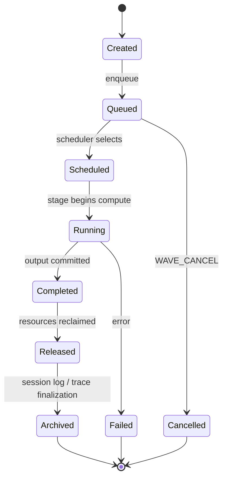

# RFC-0013 — Distributed Runtime Protocol v2 (plan v3)

## Deliverable

**[`docs/RFC_0013_DISTRIBUTED_RUNTIME_PROTOCOL_V2.md`](docs/RFC_0013_DISTRIBUTED_RUNTIME_PROTOCOL_V2.md)**

Тип документа: **Architectural Specification** (не task spec, не implementation guide).

Язык: **English**. Стиль: декларативный (MUST/MAY) + Rationale рядом с каждым ключевым требованием.

---

## Meta: declarative RFC

RFC фиксирует **что система MUST делать** и **почему**, не **как писать код**.

| Prescriptive (запрещено в normative text) | Declarative (нормативный стиль) |
|-------------------------------------------|----------------------------------|
| Queue depth = 2 | Runtime MUST support configurable queue depth. Initial implementation MAY use depth=2. |
| WaveDispatcher in node_agent | Runtime MUST support wave scheduling. Placement is an implementation decision. |
| Option A (recommended) | Transport MUST support event framing with replay. Binding is an implementation decision. |

**RFC language guide:** MUST / SHALL / MUST NOT / SHOULD / MAY. Illustrations — `(non-normative)` в Appendix.

**Requirement + Rationale pattern** (применять во всех normative разделах):

```
Requirement: Every protocol event MUST include WaveID.
Rationale:   Without WaveID there is no globally consistent
             correlation across workers (proven in Task 12).
```

---

## Document structure (final)

```
Part I — Direction
  0.  Header (Status, Date, Depends on, Scope, Implementation Freeze)
  1.  Vision                              ← NEW
  2.  Design Priorities                   ← NEW
  3.  Executive Summary (Task 12 proof)
  4.  Goals
  5.  Non-Goals
  6.  Architectural Principles
  7.  Invariants
  8.  Architectural Anti-patterns         ← NEW
  9.  Glossary                            ← NEW

Part II — Baseline & Analysis
  10. Runtime v1 (descriptive baseline)
  11. Performance Model (Task 12 evidence)
  12. Autoregressive Constraints
  13. Independence Analysis

Part III — Runtime v2 Specification
  14. Wave — Primary Execution Unit       ← strengthened
  15. WaveID
  16. Wave Lifecycle                      ← NEW (macro lifecycle)
  17. Runtime State Machine (per-stage states)
  18. Wire Protocol v2 (requirements + rationale per event)
  19. Runtime Queues (requirements)
  20. Scheduling (requirements)
  21. Resource Ownership
  22. Failure Recovery
  23. Tracing v2

Part IV — Ecosystem & Path Forward
  24. Compatibility
  25. Migration Plan
  26. Risks
  27. Future Extensions                   ← NEW
  28. Success Metrics                     ← NEW (distinct from Acceptance)
  29. Acceptance Criteria

Part V — Closing
  30. Runtime Philosophy                  ← NEW (final section)

Appendix A. Illustrative event catalog (non-normative)
Appendix B. v1 evidence citations
Appendix C. Requirement index (cross-reference table)
```

Нумерация в финальном документе MAY be compressed для читаемости (например Part I как §1–§9), но все разделы обязательны.

---

## Part I — Direction (new & expanded)

### §1 Vision (NEW)

~1 page. Sets decision-making context for everything that follows.

**Opening statement:**

> Runtime v2 exists to maximize distributed inference efficiency while preserving deterministic execution and heterogeneous cluster support.

**Three theses:**

1. **One model.** A single Runtime Descriptor describes semantics; no model-family branching in runtime paths.
2. **Many machines.** Compute is distributed across heterogeneous nodes; topology is a planner output, not a hardcoded layout.
3. **One runtime.** A distributed cluster behaves as **one logical inference engine**, not a collection of cooperating workers synchronizing via blocking RPC.

**Contrast with v1 (one paragraph):**

v1 proved (Task 12) that network and compute are not the bottleneck — the synchronous request-response protocol is. v2 replaces that protocol without replacing the descriptor, planner, or compute stack.

---

### §2 Design Priorities (NEW)

Explicit conflict-resolution hierarchy. When trade-offs arise, higher priority wins.

```
Priority 1 — Correctness
Priority 2 — Determinism
Priority 3 — Performance (throughput)
Priority 4 — Latency (TTFT, per-token)
Priority 5 — Convenience (API ergonomics, debug tooling)
```

**Normative rule:**

> Runtime v2 MUST NOT sacrifice Priority N to improve Priority N+1.

**Example baked in:**

> Q: Can we go faster if we tolerate occasional races?
> A: No. Correctness (P1) and Determinism (P2) outrank Performance (P3).

---

### §3 Executive Summary

Task 12 proof numbers (unchanged):

| Metric | v1 measured |
|--------|------------:|
| Network/hop | < 0.1 ms |
| Critical path | 13.6–23.7 ms |
| Wall period | 54–66 ms |
| Bubble | ~41–42 ms (64–75%) |
| TPS actual | ~15–18 tok/s |
| TPS ceiling (bubble=0) | 42–74 tok/s |

One sentence: **the bottleneck is protocol architecture, not network or model compute.**

---

### §4 Goals

Runtime v2 MUST:

- eliminate synchronous pipeline bubbles between decode steps
- maximize steady-state throughput bounded by autoregressive critical path
- preserve deterministic outputs (bit-exact parity with v1, same seed/sampler)
- remain descriptor-driven
- preserve layer-first runtime and sparse loading
- support heterogeneous clusters
- preserve extensibility for speculative decoding and continuous batching

Runtime v2 SHOULD:

- make pipeline utilization measurable and attributable per WaveID

Each goal: **Requirement + Rationale** paragraph.

---

### §5 Non-Goals

Runtime v2 does NOT attempt to:

- redesign GGML / KV cache / descriptor / planner / tokenizer protocol / kernels
- implement speculative decoding, continuous batching, WAN, RDMA (see §27 Future Extensions)
- prescribe component placement or threading model

---

### §6 Architectural Principles

10 principles (P1–P10) — unchanged from plan v2. Each with Rationale referencing Task 11/12 lessons where applicable.

---

### §7 Invariants

10 invariants (I1–I10) — unchanged. Each testable; cross-referenced in Acceptance Criteria.

---

### §8 Architectural Anti-patterns (NEW)

Explicit prohibitions — the mistakes that broke Task 11 and v1 performance.

Runtime v2 MUST NOT:

| Anti-pattern | Rationale |
|--------------|-----------|
| depend on RPC request-response ordering for correctness | v1 bubble source (Task 12) |
| depend on TCP message arrival ordering for state inference | violates P6; races under async |
| infer protocol state from message timing or gaps | Task 12 had to infer bubble post-hoc |
| materialize GGUF during inference | violates layer-first invariant (Task 11) |
| perform model-family branching outside descriptor construction | Task 11 architecture violation |
| hide protocol state inside implementation (implicit FSM) | causes Hotfix 11.3 class regressions |
| store resource ownership implicitly (who owns KV, hidden, wave) | causes races when async introduced |
| use local counters (`token_idx`, `debug_step`) for cross-node correlation | proven broken in Task 12 |
| block unrelated work synchronously | 41 ms bubble |
| add "temporary" protocol shortcuts without RFC amendment | Hotfix anti-pattern |

---

### §9 Glossary (NEW)

Canonical definitions — prevents terminology drift.

| Term | Definition |
|------|------------|
| **Wave** | The primary execution unit of Runtime v2; one unit of inference work (prefill chunk or single decode step). |
| **WaveID** | Globally unique identifier of a Wave within a session; sole runtime correlation key. |
| **Stage** | A pipeline compute segment (entry / middle / final) executing a layer range from the descriptor. |
| **Boundary** | The hidden-state transfer point between two stages. |
| **Position** | Sequence index in KV cache for a Wave; attribute of Wave, not a correlation key. |
| **Token** | A vocabulary item (input or output); attribute of Wave, not the execution unit. |
| **Step** | Deprecated in v2 context; use Wave. v1: one decode iteration in `run_local_pipeline_generate`. |
| **Iteration** | Deprecated; use Wave or session-level generate loop. |
| **Trace** | A perf_trace collection run identified by `trace_id` (session-scoped, not per-wave). |
| **Event** | A protocol or trace message carrying WaveID, type, and timestamp. |
| **Session** | A client inference context with KV state, descriptor graph, and monotonic WaveID sequence. |
| **Pipeline** | Ordered chain of stages for a session. |
| **Worker** | OS process executing compute for one stage (`split_gen3_*`). |
| **Role** | Descriptor-defined runtime service (tokenizer, embedding, pipeline_stage, output_head, sampler). |
| **Bubble** | Idle time between end of critical path for wave W and start of wave W+1. |
| **Scheduler** | Component enforcing wave dispatch rules (invariants I4, I5); placement not prescribed. |

---

## Part II — Baseline & Analysis

### §10 Runtime v1

Descriptive baseline (not normative). Full flow, blocking matrix, wire messages, mutex/socket ownership.

**v1 correlation chaos table** — motivates WaveID (unchanged).

Evidence: [`node_agent.cpp:1057-1245`](llama.cpp/tools/distributed/node_agent.cpp), [`split_tcp_wire.h`](llama.cpp/tools/distributed/transport/split_tcp_wire.h).

---

### §11 Performance Model

Task 12 numbers, formulas, budget table. Descriptive + one forward-reference requirement:

> v2 MUST reduce bubble below Success Metrics threshold (§28).

---

### §12–§13 Autoregressive Constraints & Independence

Hard dependencies (Sample[P] → Input[P+1], KV, position, hidden chain).

**Key v2 requirement + rationale:**

> Requirement: Response unwind MUST NOT gate dispatch of the next wave.
> Rationale: Task 12 proved 41 ms bubble is protocol overhead, not autoregressive law.

---

## Part III — Runtime v2 Specification

### §14 Wave — Primary Execution Unit (strengthened)

**Opening (normative statement):**

> **Wave is the primary execution unit of Runtime v2.**

Not RPC. Not token. Not HTTP request. Everything in the runtime — scheduling, queues, tracing, recovery, metrics — is defined in terms of Waves.

**What a Wave represents:**

- One logical inference step: a prefill chunk (multi-token) or a single decode step (one token)
- Carries all attributes needed for scheduling, execution, and correlation
- Has explicit lifecycle (§16) and state machine (§17)

**Wave attributes (normative):**

| Field | Required | Rationale |
|-------|----------|-----------|
| WaveID | MUST | sole correlation key |
| session_id | MUST | scopes KV and descriptor graph |
| position | MUST | KV addressing; monotonic per session |
| input_token(s) | MUST for decode; multi for prefill | feeds entry compute |
| output_token | set at completion | autoregressive chain link |
| status | MUST be explicit | no inferred state |
| owner_stage | MUST | enforces I1 |

---

### §15 WaveID

> **WaveID is the primary identifier of Runtime v2.**

Everything references WaveID:

| Domain | Requirement | Rationale |
|--------|-------------|-----------|
| Tracing | every perf event MUST include WaveID | ends ordinal/token_idx alignment hacks |
| Wire protocol | every event payload MUST include WaveID | cross-node correlation |
| Queues | entries keyed by WaveID | FIFO ordering, backpressure |
| Recovery | cancel/retry scoped to WaveID | I10 isolation |
| Metrics | throughput, bubble, utilization per WaveID | trace-verifiable (P10) |
| Logs | structured logs MUST include WaveID | ops debuggability |

`token_idx`, `debug_step`, `ordinal` — deprecated; MAY exist as debug aliases during migration only.

---

### §16 Wave Lifecycle (NEW — macro lifecycle)

Distinct from per-stage state machine (§17). Macro lifecycle every Wave traverses:



| Phase | Meaning |
|-------|---------|
| **Created** | WaveID assigned; attributes set; not yet in any queue |
| **Queued** | Waiting in stage inbound queue |
| **Scheduled** | Selected by scheduler; dependencies satisfied |
| **Running** | Active compute at one or more stages (intra-wave pipeline overlap) |
| **Completed** | Output token committed; KV updated |
| **Released** | Per-wave resources freed; WaveID may be reused only in new session |
| **Archived** | Trace and session log finalized; read-only |

**Requirement:** Every phase transition MUST be representable in traces.
**Rationale:** Enables debugging and postmortem analysis years after deployment.

---

### §17 Runtime State Machine (per-stage)

Fine-grained stage states within Running phase:

`EntryRunning → MiddleRunning → FinalRunning → SampleReady → Delivered`

+ `Failed`, `Cancelled`. Transition table with event authority. Requirement + Rationale per transition.

---

### §18–§20 Wire Protocol, Queues, Scheduling

Each section: numbered requirements, each with Rationale. No component names, no default depths, no transport binding.

**Wire — key requirements:**
1. MUST replace synchronous REQUEST→RESPONSE with asynchronous events
2. Every event MUST carry WaveID, session_id, event_type, sequence
3. Events MUST be idempotent under replay
4. MUST support selective ACK and explicit cancellation
5. MUST be version-negotiable

**Queues — key requirements:**
1. Each stage MUST have inbound queue
2. Depth MUST be configurable
3. MUST apply backpressure when full
4. Policy MUST be FIFO by WaveID
5. MUST NOT drop or reorder

**Scheduling — key requirements:**
1. MUST support wave scheduling per invariants I4, I5
2. MUST enforce autoregressive dependency
3. MUST respect backpressure
4. MUST NOT require planner/descriptor changes

Appendix A: illustrative event catalog (non-normative).

---

### §21–§23 Ownership, Recovery, Tracing

Normative rules with Rationale. Tracing schema:

```json
{
  "trace_id": "trace-000042",
  "WaveID": 17,
  "stage": "entry",
  "state": "Running",
  "event": "ENTRY_COMPUTE_BEGIN",
  "ts_us": 18420391
}
```

---

## Part IV — Ecosystem & Path Forward

### §24 Compatibility

Impact matrix: what MUST / MUST NOT change per subsystem.

### §25 Migration Plan

6 phases; exit criteria observable; rollback via version flag. No component names in exit criteria.

### §26 Risks

Requirement-violation oriented; verification + rollback per risk.

### §27 Future Extensions (NEW)

**Explicitly not part of v2 scope, but v2 MUST NOT preclude:**

| Extension | How v2 preserves extensibility |
|-----------|-------------------------------|
| Speculative decoding | multiple in-flight waves; WaveID generalizes |
| Continuous batching | queue model + WaveID per batch slot |
| Dynamic rebalancing | explicit wave cancellation + session pause |
| Pipeline reconfiguration | session-scoped; waves drain before reconfig |
| Checkpoint / KV migration | Wave position + session_id as migration key |
| WAN mode | replayable events; no ordering assumption |
| RDMA / zero-copy hidden | boundary abstraction; payload format versioned |
| FP16 / compressed hidden | event payload versioning |
| MoE routing | descriptor-driven; stage model unchanged |

**Normative statement:**

> Future extensions MAY be added without RFC v2 amendment if they respect Invariants (§7) and Anti-patterns (§8).

Extensions that violate invariants require RFC amendment.

---

### §28 Success Metrics (NEW — distinct from Acceptance)

**"How do we know Runtime v2 succeeded?"** — directional targets, not gate checklist.

#### Near-term (Task 13 completion)

| Metric | Target | Context |
|--------|-------:|---------|
| Throughput | ≥ 50 tok/s | TinyLlama, 3-node Docker CPU, steady decode |
| Pipeline utilization | ≥ 80% | compute / wall per WaveID |
| Bubble | < 10% | of steady-state period |
| Queue depth | > 1 | observable in trace during decode |
| Descriptor compatibility | 100% | all Task 11 descriptors pass |
| Deterministic replay | 100% | same seed/prompt → same tokens as v1 |

#### Long-term (vision horizon)

| Capability | Notes |
|------------|-------|
| 100B+ models | heterogeneous cluster, no architecture change |
| Internet / WAN nodes | event replay, no TCP ordering dependency |
| Speculative decoding | multiple waves in flight |
| Continuous batching | shared stage queues across sessions |
| Heterogeneous hardware | CPU + GPU mixed stages |

Success Metrics inform design; Acceptance Criteria gate release.

---

### §29 Acceptance Criteria

**Functional** — checklist (document complete, invariants testable, migration defined).

**Performance** — measurable gates (subset of Success Metrics, hard thresholds):

| Metric | Threshold | Method |
|--------|-----------|--------|
| Bubble | < 10% | `pipeline_stall_analysis.py`, WaveID-aligned |
| Queue depth | > 1 | `queue.json` |
| Utilization | > 80% | `bottleneck.py` |
| TPS | ≥ 0.8 × ceiling | Task 12 methodology |
| Task 11 regression | 0 failures | PreSmoke + benchmark |
| Determinism | 100% replay parity | parity tests |
| Materialization | worker_gguf_bytes = 0 | benchmark report |

**Non-regression:** no descriptor/planner/GGML changes.

---

## Part V — Closing

### §30 Runtime Philosophy (NEW — final section)

~1 page. The document's closing anchor — what Runtime v2 *is*.

> Runtime v2 is **event-driven**. Not RPC-driven.
>
> Runtime v2 is **protocol-first**. Not implementation-first.
>
> Runtime v2 treats a distributed cluster as **one logical inference engine**.
>
> - **Workers** execute.
> - **Protocol** coordinates.
> - **Descriptors** describe.
> - **Runtime** schedules.
> - Nothing else.

**Closing contrast:**

| v1 mental model | v2 mental model |
|-----------------|-----------------|
| send request, wait for response | emit event, advance wave |
| token loop | wave lifecycle |
| infer stall from gaps | measure bubble by WaveID |
| workers cooperate | one engine, many executors |

---

## Appendices

| Appendix | Content |
|----------|---------|
| A | Illustrative event catalog (non-normative) |
| B | v1 evidence citations (code paths, Task 12 logs) |
| C | Requirement index (§ → all MUST statements, cross-ref to Rationale) |

---

## Freeze boundary

No changes to `orchestrator.cpp`, `node_agent.cpp`, `split_gen3_a/b/c.cpp` until RFC status = **Accepted**.

---

## Plan revision history

| Revision | Changes |
|----------|---------|
| v1 | Initial 15-section plan; prescriptive (WaveDispatcher, depth=2) |
| v2 | Declarative MUST/MAY; Goals, Principles, Invariants; measurable Acceptance |
| v3 | Vision, Design Priorities, Anti-patterns, Glossary, Wave Lifecycle, Future Extensions, Success Metrics, Runtime Philosophy; Requirement+Rationale pattern; Wave as primary execution unit |

## After RFC approval

- Task 13.x implementation specs record concrete choices (scheduler placement, transport, default depth)
- Each implementation choice references RFC requirement + satisfies Success Metrics
- Future extensions (§27) get their own RFC amendments only if invariants are affected
