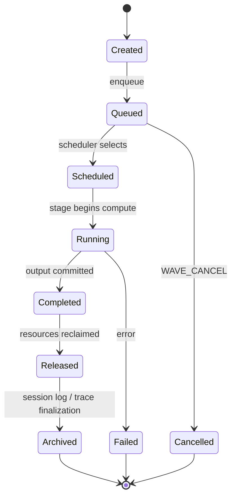

# RFC-0013 — Distributed Runtime Protocol v2

**Status:** Accepted  
**Date:** 2026-07-07  
**Depends on:** Task 11 (layer-first runtime, Runtime Descriptor), Task 12 (performance profiler, pipeline stall analysis)  
**Scope:** Architectural specification for the distributed inference wire protocol and runtime scheduling model  
**Implementation freeze:** No changes to `orchestrator.cpp`, `node_agent.cpp`, `split_gen3_a/b/c.cpp`, or related inference hot-path code until this RFC status is **Accepted**.

---

## RFC Language Guide

Normative terms follow [RFC 2119](https://datatracker.ietf.org/doc/html/rfc2119):

| Term | Meaning |
|------|---------|
| **MUST / SHALL** | Absolute requirement |
| **MUST NOT** | Absolute prohibition |
| **SHOULD** | Recommended; deviation requires documented justification |
| **MAY** | Optional |

Illustrative examples, byte layouts, default depths, and component placement are marked **(non-normative)** and appear in appendices only.

### Requirement + Rationale Pattern

Every key normative statement in this document uses:

```
Requirement: <what the system MUST do>
Rationale:   <why, with Task 11/12 evidence where applicable>
```

### Declarative vs Prescriptive

This RFC specifies **observable behavior and invariants**, not implementation choices.

| Prescriptive (forbidden in normative text) | Declarative (normative style) |
|-------------------------------------------|-------------------------------|
| Queue depth = 2 | Runtime MUST support configurable queue depth. Initial implementation MAY use depth=2. |
| WaveDispatcher in node_agent | Runtime MUST support wave scheduling. Placement is an implementation decision. |
| Option A (recommended) | Transport MUST support event framing with replay. Binding is an implementation decision. |

---

# Part I — Direction

## 1. Vision

Runtime v2 exists to maximize distributed inference efficiency while preserving deterministic execution and heterogeneous cluster support.

### Three Theses

1. **One model.** A single Runtime Descriptor describes semantics; no model-family branching in runtime paths.
2. **Many machines.** Compute is distributed across heterogeneous nodes; topology is a planner output, not a hardcoded layout.
3. **One runtime.** A distributed cluster behaves as **one logical inference engine**, not a collection of cooperating workers synchronizing via blocking RPC.

### Contrast with v1

Task 12 proved that network latency and per-stage compute are not the bottleneck in the current 3-node Docker CPU pipeline. The synchronous request-response protocol is. Measured network hops are under 0.1 ms; critical path compute is 13.6–23.7 ms; yet wall period per token is 54–66 ms because the orchestrator blocks on a full round-trip before dispatching the next token. Runtime v2 replaces that protocol without replacing the Runtime Descriptor, planner, layer store, or GGML compute stack.

---

## 2. Design Priorities

When trade-offs conflict, higher priority wins.

```
Priority 1 — Correctness
Priority 2 — Determinism
Priority 3 — Performance (throughput)
Priority 4 — Latency (TTFT, per-token)
Priority 5 — Convenience (API ergonomics, debug tooling)
```

**Requirement:** Runtime v2 MUST NOT sacrifice Priority N to improve Priority N+1.

**Rationale:** Without an explicit hierarchy, performance shortcuts (async races, dropped events, non-deterministic ordering) will erode the correctness guarantees that Task 11 established across eight model families.

**Example:**

> Q: Can we go faster if we tolerate occasional races?  
> A: No. Correctness (P1) and Determinism (P2) outrank Performance (P3).

---

## 3. Executive Summary

Task 12 pipeline stall analysis (Docker, TinyLlama, 3-node CPU) measured the following steady-state decode metrics for Runtime v1:

| Metric | v1 measured |
|--------|------------:|
| Network/hop | < 0.1 ms |
| Critical path (entry recv → final compute end) | 13.6–23.7 ms |
| Wall period (entry recv to entry recv) | 54–66 ms |
| Pipeline bubble (period − critical path) | ~41–42 ms (64–75%) |
| TPS actual | ~15–18 tok/s |
| TPS ceiling (bubble = 0) | 42–74 tok/s |

**Conclusion:** The bottleneck is protocol architecture, not network bandwidth or model compute.

Evidence: [`docs/TASK_12_PIPELINE_STALL_ANALYSIS_DOCKER.md`](TASK_12_PIPELINE_STALL_ANALYSIS_DOCKER.md), `logs/perf_trace/docker_verify_20260707_151625/`.

---

## 4. Goals

### 4.1 Mandatory Goals

Runtime v2 MUST:

**G1 — Eliminate synchronous pipeline bubbles**

Requirement: Response unwind MUST NOT gate dispatch of the next wave.  
Rationale: Task 12 measured 41 ms bubble (75% of token period) caused by blocking `pipeline_gen3_send_recv` per decode step.

**G2 — Maximize steady-state throughput**

Requirement: Steady-state throughput MUST approach the autoregressive critical-path ceiling, bounded by compute and mandatory data dependencies, not protocol overhead.  
Rationale: v1 achieves ~15–18 tok/s against a 42–74 tok/s ceiling when bubble is removed.

**G3 — Preserve deterministic outputs**

Requirement: For identical seed, sampler configuration, and prompt, v2 MUST produce bit-exact token parity with v1.  
Rationale: Task 11 validated correctness across eight model families; protocol changes must not regress determinism.

**G4 — Remain descriptor-driven**

Requirement: Runtime paths MUST NOT branch on model family names. All semantics MUST come from the Runtime Descriptor.  
Rationale: Task 11 architecture violation class (Hotfix 11.3) arose from implicit role inference outside the descriptor.

**G5 — Preserve layer-first runtime**

Requirement: Inference MUST NOT materialize full worker GGUF files. Layer store and sparse tensor loading MUST remain the inference path.  
Rationale: Task 11 benchmark confirmed `worker_gguf_bytes = 0` for all eight models.

**G6 — Support heterogeneous clusters**

Requirement: Protocol MUST support mixed node capabilities (CPU/GPU, varying memory, 2-node and 3-node pipelines) without architecture changes.  
Rationale: Planner assigns topology; protocol must not assume symmetric hardware.

**G7 — Preserve speculative decoding extensibility**

Requirement: Protocol MUST NOT preclude multiple in-flight waves per session where the model and sampler allow.  
Rationale: Future extensions (§27) depend on WaveID generalizing beyond single-wave decode.

**G8 — Preserve continuous batching extensibility**

Requirement: Queue model and WaveID MUST generalize beyond single-session serial decode.  
Rationale: Shared stage queues across sessions require per-slot WaveID correlation.

### 4.2 Recommended Goals

Runtime v2 SHOULD:

**G9 — Reduce inter-token idle**

Requirement: Inter-token idle SHOULD be below 10% of steady-state wall period (see §28 Success Metrics).  
Rationale: Task 12 baseline is 64–75% idle; v2 target is an order-of-magnitude improvement.

**G10 — Per-WaveID attribution**

Requirement: Pipeline utilization, bubble, and throughput SHOULD be measurable and attributable per WaveID.  
Rationale: Task 12 required post-hoc ordinal alignment because `token_idx` diverges across workers.

---

## 5. Non-Goals

Runtime v2 does NOT attempt to:

- redesign GGML, its internal compute scheduler, or GPU backends
- redesign KV cache storage format or attention implementation
- change Runtime Descriptor schema or Architecture Descriptor format
- change layer planner or role planner algorithms
- change tokenizer, embedding, or output HTTP service protocols
- implement speculative decoding, continuous batching, WAN mode, or RDMA (see §27 Future Extensions)
- solve dynamic runtime rebalancing or live node migration
- prescribe component placement, threading model, or transport binding

---

## 6. Architectural Principles

### P1 — Protocol First

Requirement: Coordination MUST be expressed as an explicit event protocol, not implicit blocking RPC semantics.  
Rationale: v1 correctness depends on request-response ordering; Task 12 proved this creates 75% pipeline bubble.

### P2 — Explicit State

Requirement: Wave and stage state MUST be represented explicitly in protocol events and traces. State MUST NOT be inferred from timing, message gaps, or arrival order.  
Rationale: Task 12 stall analysis required post-hoc gap inference; v2 must make bubble measurable by WaveID at runtime.

### P3 — Wave-Centric Execution

Requirement: Wave is the primary execution unit. Scheduling, queues, tracing, recovery, and metrics MUST be defined in terms of Waves, not tokens, HTTP requests, or RPC calls.  
Rationale: Token is an attribute of a Wave; conflating token with execution unit caused correlation chaos in v1 tracing.

### P4 — Descriptor-Driven

Requirement: Runtime behavior MUST be fully determined by the Runtime Descriptor and session execution graph. No model-family branches outside descriptor construction.  
Rationale: Task 11 established descriptor-owned semantics as the architecture contract.

### P5 — Layer-First

Requirement: Inference path MUST use layer store and sparse tensor providers. Full GGUF materialization on the inference hot path is forbidden.  
Rationale: Task 11 validated zero materialization across all benchmark models.

### P6 — Ordering Independence

Requirement: Protocol correctness MUST NOT depend on TCP message arrival ordering. Events MUST be idempotent under replay and carry sufficient metadata for out-of-order reconciliation.  
Rationale: Async multi-wave dispatch and future WAN mode require transport ordering independence.

### P7 — Explicit Ownership

Requirement: Ownership of KV slots, hidden buffers, and wave lifecycle resources MUST be explicit and transferable only via defined protocol events.  
Rationale: Implicit ownership caused races when async paths were considered; Hotfix 11.3 class regressions arose from hidden state.

### P8 — Deterministic Execution

Requirement: Given fixed seed, sampler config, and prompt, execution MUST be reproducible. Non-determinism MUST be confined to documented sampler entropy sources.  
Rationale: Design Priority 2 (Determinism) and Goal G3.

### P9 — Backpressure-Aware

Requirement: Queues MUST propagate backpressure upstream when full. Unbounded buffering is forbidden.  
Rationale: Without backpressure, async dispatch causes memory growth and silent drops under load.

### P10 — Trace-Verifiable Metrics

Requirement: Every performance claim (bubble, utilization, throughput) MUST be derivable from traces keyed by WaveID.  
Rationale: Task 12 proved that metrics without WaveID correlation require ordinal alignment hacks and are not attributable.

---

## 7. Invariants

Each invariant is testable and cross-referenced in §29 Acceptance Criteria.

| ID | Invariant | Test |
|----|-----------|------|
| **I1** | At any instant, each wave resource (KV slot, hidden buffer, stage execution slot) has exactly one owner. | Ownership audit in trace; no concurrent writers per WaveID+resource |
| **I2** | Wave status MUST be explicit; MUST NOT be inferred from timing or message gaps. | State machine coverage in trace events |
| **I3** | For autoregressive decode, wave W+1 input_token MUST equal wave W output_token (same session). | Parity test across v1/v2 |
| **I4** | Multiple waves MAY be in flight, but autoregressive dependency (I3) and queue depth limits MUST be respected. | Queue depth > 1 with valid token chain |
| **I5** | Stage inbound queue depth MUST NOT exceed configured maximum; backpressure MUST propagate upstream. | `queue.json` depth ≤ configured max |
| **I6** | All cross-node protocol and trace events MUST include WaveID. | Schema validation on all events |
| **I7** | KV update for position P MUST complete before any wave at position P+1 reads KV for that session. | Position-ordered trace spans |
| **I8** | Same seed/sampler/prompt produces identical token sequence (v1 parity). | Deterministic replay test |
| **I9** | Waves within a session MUST NOT be dropped or reordered. | FIFO by WaveID in queue traces |
| **I10** | Failure or cancellation of wave W MUST NOT corrupt committed state of other waves in the same session. | Fault injection + parity |

---

## 8. Architectural Anti-Patterns

Runtime v2 MUST NOT exhibit the following patterns. These are the mistakes that broke Task 11 performance and v1 throughput.

| Anti-pattern | Rationale |
|--------------|-----------|
| Depend on RPC request-response ordering for correctness | v1 bubble source (Task 12) |
| Depend on TCP message arrival ordering for state inference | Violates P6; races under async |
| Infer protocol state from message timing or gaps | Task 12 had to infer bubble post-hoc |
| Materialize GGUF during inference | Violates layer-first invariant (Task 11) |
| Perform model-family branching outside descriptor construction | Task 11 architecture violation |
| Hide protocol state inside implementation (implicit FSM) | Causes Hotfix 11.3 class regressions |
| Store resource ownership implicitly (who owns KV, hidden, wave) | Causes races when async is introduced |
| Use local counters (`token_idx`, `debug_step`) for cross-node correlation | Proven broken in Task 12 |
| Block unrelated work synchronously | 41 ms bubble per token |
| Add "temporary" protocol shortcuts without RFC amendment | Hotfix anti-pattern |

---

## 9. Glossary

| Term | Definition |
|------|------------|
| **Wave** | The primary execution unit of Runtime v2; one unit of inference work (prefill chunk or single decode step). |
| **WaveID** | Globally unique identifier of a Wave within a session; sole runtime correlation key. |
| **Stage** | A pipeline compute segment (entry / middle / final) executing a layer range from the descriptor. |
| **Boundary** | The hidden-state transfer point between two stages. |
| **Position** | Sequence index in KV cache for a Wave; attribute of Wave, not a correlation key. |
| **Token** | A vocabulary item (input or output); attribute of Wave, not the execution unit. |
| **Step** | Deprecated in v2 context; use Wave. v1: one decode iteration in `run_local_pipeline_generate`. |
| **Iteration** | Deprecated; use Wave or session-level generate loop. |
| **Trace** | A perf_trace collection run identified by `trace_id` (session-scoped, not per-wave). |
| **Event** | A protocol or trace message carrying WaveID, type, and timestamp. |
| **Session** | A client inference context with KV state, descriptor graph, and monotonic WaveID sequence. |
| **Pipeline** | Ordered chain of stages for a session. |
| **Worker** | OS process executing compute for one stage (`split_gen3_*`). |
| **Role** | Descriptor-defined runtime service (tokenizer, embedding, pipeline_stage, output_head, sampler). |
| **Bubble** | Idle time between end of critical path for wave W and start of wave W+1. |
| **Scheduler** | Component enforcing wave dispatch rules (invariants I4, I5); placement not prescribed. |

---

# Part II — Baseline and Analysis

## 10. Runtime v1 (Descriptive Baseline)

*This section is descriptive, not normative. It documents the current system to motivate v2 requirements.*

### 10.1 Session Generate Flow

1. Client sends HTTP `POST /session/generate` to orchestrator.
2. Orchestrator tokenizes prompt (or delegates to tokenizer service).
3. Entry node-agent calls `run_local_pipeline_generate` which connects to local entry worker control socket.
4. **Prefill:** `SPLIT_GEN_CMD_PREFILL` (or `PREFILL_HIDDEN`) with all prompt tokens.
5. **Decode loop:** For each new token, `SPLIT_GEN_CMD_DECODE` with `n_tokens=1`, blocking until response.
6. Orchestrator returns full token sequence to client.

Code anchor: `run_local_pipeline_generate` in `llama.cpp/tools/distributed/node_agent.cpp` (lines 1086–1245).

### 10.2 Blocking Matrix

| Operation | Blocks caller until |
|-----------|---------------------|
| `pipeline_gen3_send_recv` | Full entry→middle→final→entry round-trip |
| `split_gen_recv_req` (entry worker) | Next control request arrives |
| `split_ab_recv_hidden` (middle/final) | Next hidden tensor arrives |
| Decode loop iteration | Previous token fully sampled and returned |

### 10.3 Wire Messages (v1)

Control plane (`split_gen_a_req` / `split_gen_a_resp`):

- Commands: `RESET`, `PREFILL`, `DECODE`, `SHUTDOWN`, `PREFILL_HIDDEN`, `DECODE_HIDDEN`
- Synchronous request-response on single control TCP connection per entry worker

Data plane (`split_tcp_header` + float payload):

- Hidden state transfer between stages
- No WaveID, no event sequence, no replay semantics

Code anchor: `llama.cpp/tools/distributed/transport/split_tcp_wire.h`.

### 10.4 v1 Correlation Chaos

Task 12 tracing exposed multiple incompatible correlation keys:

| Key | Scope | Problem |
|-----|-------|---------|
| `token_idx` | Per-worker local counter | Diverges across stages; middle may tag prior wave |
| `debug_step` | Entry node-agent local | Not visible on middle/final |
| `ordinal` | Post-hoc alignment by receive order | Not in wire protocol; requires analysis scripts |
| `trace_id` | Session-scoped | Correct scope but not per-wave |

**Requirement (forward reference):** v2 MUST use WaveID as the sole cross-node correlation key (§15).

**Rationale:** Task 12 `pipeline_stall_analysis.py` aligns stages by receive ordinal, not `token_idx`, because local counters are unreliable.

### 10.5 Mutex and Socket Ownership (v1)

- One control socket per entry worker; orchestrator holds client end during entire generate.
- Hidden transfer sockets are dedicated per stage pair (entry→middle, middle→final).
- No queue beyond single in-flight message per worker.

---

## 11. Performance Model

### 11.1 Task 12 Steady-State Budget

For TinyLlama, 3-node Docker CPU, steady decode (tokens 2–7):

| Component | ms | % of period |
|-----------|---:|------------:|
| Entry compute | 13.7 | 25% |
| Middle compute | 9.1 | 17% |
| Final compute | 5.0 | 9% |
| Critical path (overlapped) | 13.6 | 25% |
| Network hops | < 0.1 | < 1% |
| **Bubble (protocol overhead)** | **40.8** | **75%** |
| **Wall period** | **54.4** | 100% |

### 11.2 Throughput Formulas

```
TPS_actual   = tokens / wall_time
TPS_ceiling  = 1000 / critical_path_ms        (if bubble = 0)
bubble_pct   = (period - critical_path) / period × 100
utilization  = critical_path / period × 100   (pipeline-level)
```

v1 measured: `TPS_actual ≈ 15–18`, `TPS_ceiling ≈ 42–74`, `bubble_pct ≈ 64–75%`.

### 11.3 Queue Depth Observation

v1 `queue.json` shows depth = 1 for all stages at all times. This is not "pipeline filled to capacity" — it reflects single in-flight token dispatch.

### 11.4 Forward Requirement

**Requirement:** v2 MUST reduce bubble below the Success Metrics threshold (§28: < 10% of steady-state period).

**Rationale:** 75% bubble is pure protocol overhead; autoregressive law requires only that wave W+1 input depends on wave W output, not that the orchestrator blocks 41 ms between dispatches.

---

## 12. Autoregressive Constraints

Autoregressive decode imposes hard data dependencies that v2 MUST preserve:

```
Sample[P] → input_token[P+1]
KV cache positions 0..P must be valid before compute at P+1
Position P+1 must be set before forward at P+1
Hidden[P+1] flows entry → middle → final
```

These dependencies define the **minimum critical path** (~13.6 ms for TinyLlama 3-node). They do NOT require:

- Blocking the orchestrator until the full response unwinds to the client
- Serializing all protocol events on a single socket
- Queue depth = 1

**Requirement:** Response unwind MUST NOT gate dispatch of the next wave.

**Rationale:** Task 12 proved 41 ms bubble is protocol overhead, not autoregressive law. Token 17 timeline shows orchestrator waits ~42 ms after final sample before dispatching token 18, despite critical path completing in ~24 ms.

---

## 13. Independence Analysis

Subsystems that v2 protocol changes MUST NOT require modifying:

| Subsystem | Independence |
|-----------|--------------|
| Runtime Descriptor | Unchanged schema; same service graph |
| Layer store / tensor providers | Unchanged; workers still load sparse tensors |
| GGML compute graphs | Unchanged; per-stage forward pass identical |
| KV cache internals | Unchanged; position addressing unchanged |
| Tokenizer / embedding / output HTTP APIs | Unchanged client surface |
| Planner / install planner | Unchanged; topology assignment unchanged |
| Sampler determinism | Unchanged; same seed produces same token |

**Requirement:** Protocol v2 MUST be implementable as a transport and scheduling layer replacement without descriptor, planner, or GGML changes.

**Rationale:** Scope boundary per Non-Goals (§5).

---

# Part III — Runtime v2 Specification

## 14. Wave — Primary Execution Unit

> **Wave is the primary execution unit of Runtime v2.**

Not RPC. Not token. Not HTTP request. Everything in the runtime — scheduling, queues, tracing, recovery, metrics — is defined in terms of Waves.

### 14.1 What a Wave Represents

- One logical inference step: a prefill chunk (multi-token) or a single decode step (one token)
- Carries all attributes needed for scheduling, execution, and correlation
- Has explicit macro lifecycle (§16) and per-stage state machine (§17)

### 14.2 Wave Attributes (Normative)

| Field | Required | Rationale |
|-------|----------|-----------|
| WaveID | MUST | Sole correlation key (§15) |
| session_id | MUST | Scopes KV and descriptor graph |
| position | MUST | KV addressing; monotonic per session for decode |
| input_token(s) | MUST for decode; multi for prefill | Feeds entry compute |
| output_token | Set at completion | Autoregressive chain link (I3) |
| status | MUST be explicit | No inferred state (I2, P2) |
| owner_stage | MUST | Enforces I1 |

**Requirement:** Runtime MUST represent all inference work as Waves with the attributes above.

**Rationale:** Conflating HTTP requests or RPC calls with execution units caused v1 correlation chaos and prevented inter-wave pipelining.

---

## 15. WaveID

> **WaveID is the primary identifier of Runtime v2.**

### 15.1 Domain Requirements

| Domain | Requirement | Rationale |
|--------|-------------|-----------|
| Tracing | Every perf event MUST include WaveID | Ends ordinal/token_idx alignment hacks |
| Wire protocol | Every event payload MUST include WaveID | Cross-node correlation |
| Queues | Entries keyed by WaveID | FIFO ordering, backpressure (I9) |
| Recovery | Cancel/retry scoped to WaveID | Failure isolation (I10) |
| Metrics | Throughput, bubble, utilization per WaveID | Trace-verifiable (P10) |
| Logs | Structured logs MUST include WaveID | Ops debuggability |

### 15.2 Deprecated Correlation Keys

`token_idx`, `debug_step`, and `ordinal` are deprecated for cross-node correlation. They MAY exist as debug aliases during migration only. They MUST NOT be used for scheduling decisions, recovery, or performance attribution in v2.

**Requirement:** WaveID MUST be monotonically assigned per session and globally unique within that session.

**Rationale:** Session scope matches KV lifetime; monotonic assignment enables FIFO queue policy.

---

## 16. Wave Lifecycle (Macro)

Distinct from per-stage state machine (§17). Every Wave traverses:



| Phase | Meaning |
|-------|---------|
| **Created** | WaveID assigned; attributes set; not yet in any queue |
| **Queued** | Waiting in stage inbound queue |
| **Scheduled** | Selected by scheduler; dependencies satisfied |
| **Running** | Active compute at one or more stages (intra-wave pipeline overlap) |
| **Completed** | Output token committed; KV updated |
| **Released** | Per-wave resources freed; WaveID may be reused only in new session |
| **Archived** | Trace and session log finalized; read-only |
| **Failed** | Unrecoverable error; isolated per I10 |
| **Cancelled** | Explicitly cancelled; no output committed |

**Requirement:** Every phase transition MUST be representable in traces.

**Rationale:** Enables debugging and postmortem analysis years after deployment.

---

## 17. Runtime State Machine (Per-Stage)

Fine-grained stage states within the Running macro phase:

```
EntryRunning → MiddleRunning → FinalRunning → SampleReady → Delivered
```

Terminal states: `Failed`, `Cancelled`.

### 17.1 Transition Table

| From | To | Triggering event | Authority |
|------|----|------------------|-----------|
| (entry queue) | EntryRunning | ENTRY_COMPUTE_BEGIN | Entry stage |
| EntryRunning | MiddleRunning | ENTRY_COMPUTE_END + boundary forward | Entry stage |
| MiddleRunning | FinalRunning | MIDDLE_COMPUTE_END + boundary forward | Middle stage |
| FinalRunning | SampleReady | FINAL_COMPUTE_END + SAMPLER_END | Final stage |
| SampleReady | Delivered | WAVE_COMPLETE or output committed | Final stage / scheduler |
| Any Running | Failed | WAVE_ERROR | Originating stage |
| Queued | Cancelled | WAVE_CANCEL | Scheduler / client |

**Requirement:** State transitions MUST be driven by explicit protocol events, not inferred from message timing.

**Rationale:** P2 (Explicit State); Task 12 could not determine orchestrator wait state from worker events alone.

**Requirement:** Intra-wave stage overlap (entry, middle, final computing different portions of the same wave) MUST be permitted.

**Rationale:** v1 already overlaps stages within one token; v2 must preserve this while adding inter-wave overlap.

---

## 18. Wire Protocol v2

### 18.1 Core Requirements

**W1 — Asynchronous events**

Requirement: Wire protocol MUST replace synchronous REQUEST→RESPONSE with asynchronous events.  
Rationale: v1 blocking round-trip is the primary bubble source.

**W2 — Event envelope**

Requirement: Every event MUST carry WaveID, session_id, event_type, and sequence number.  
Rationale: I6; enables replay and out-of-order reconciliation (P6).

**W3 — Idempotent replay**

Requirement: Events MUST be idempotent under replay. Duplicate delivery MUST NOT corrupt state.  
Rationale: WAN mode and transport retries require replay safety.

**W4 — Selective ACK and cancellation**

Requirement: Protocol MUST support selective acknowledgment and explicit wave cancellation (`WAVE_CANCEL`).  
Rationale: I10 failure isolation; backpressure without silent drop.

**W5 — Version negotiation**

Requirement: Protocol MUST be version-negotiable at session setup. v1 and v2 MAY coexist during migration.  
Rationale: §25 Migration Plan requires rollback via version flag.

### 18.2 Event Categories (Normative Semantics)

| Category | Purpose |
|----------|---------|
| Lifecycle | Wave created, queued, scheduled, completed, released, cancelled, failed |
| Compute | Stage compute begin/end per wave |
| Boundary | Hidden state forward between stages |
| Control | Session reset, shutdown, version handshake |
| Ack | Selective acknowledgment, backpressure signals |

Event type names and payload schemas are defined by implementation specs (Task 13.x). Appendix A provides a non-normative catalog.

### 18.3 Hidden State Transfer

**Requirement:** Boundary events MUST preserve the hidden-state abstraction. Payload format MUST be versioned to allow future FP16/compressed hidden (§27).

**Rationale:** Transport binding (TCP, RDMA, shared memory) is an implementation decision; the boundary contract is not.

---

## 19. Runtime Queues

**Q1 — Per-stage inbound queue**

Requirement: Each stage MUST have an inbound queue for pending waves.  
Rationale: v1 has implicit depth-1 queue; v2 requires explicit queueing for inter-wave overlap.

**Q2 — Configurable depth**

Requirement: Queue depth MUST be configurable per stage.  
Rationale: Prescriptive default forbidden; depth is an implementation tuning parameter.

**Q3 — Backpressure**

Requirement: When a queue is full, upstream MUST receive backpressure and MUST NOT silently drop or block unrelated sessions.  
Rationale: I5, P9.

**Q4 — FIFO by WaveID**

Requirement: Queue dispatch policy MUST be FIFO ordered by WaveID within a session.  
Rationale: I9; autoregressive chain depends on ordering.

**Q5 — No drop or reorder**

Requirement: Queues MUST NOT drop or reorder waves within a session.  
Rationale: I9; dropped waves break autoregressive chain (I3).

---

## 20. Scheduling

**S1 — Wave scheduling**

Requirement: Runtime MUST support wave scheduling that enforces invariants I4 and I5.  
Rationale: Inter-wave pipelining is the primary mechanism to eliminate bubble.

**S2 — Autoregressive dependency**

Requirement: Scheduler MUST enforce that wave W+1 is not dispatched until wave W output_token is committed (decode), unless speculative decoding extension is active (§27).  
Rationale: I3; hard autoregressive law.

**S3 — Backpressure respect**

Requirement: Scheduler MUST NOT dispatch into a full queue.  
Rationale: I5; unbounded dispatch causes memory growth.

**S4 — Planner independence**

Requirement: Scheduling MUST NOT require planner or descriptor changes.  
Rationale: §13 Independence Analysis.

**S5 — Multiple in-flight waves**

Requirement: Scheduler MUST support multiple waves in flight across the pipeline when queue depth and autoregressive dependencies allow.  
Rationale: G2; v1 allows only one token system-wide.

**S6 — Non-blocking dispatch**

Requirement: Dispatch of wave W+1 MUST NOT wait for client delivery or HTTP response of wave W.  
Rationale: G1; 41 ms bubble in v1.

---

## 21. Resource Ownership

| Resource | Owner during phase | Transfer event |
|----------|-------------------|----------------|
| Wave lifecycle | Scheduler | WAVE_CREATED → WAVE_QUEUED → ... |
| KV slot at position P | Stage holding active wave at P | WAVE_COMPLETED |
| Hidden buffer at boundary | Sending stage until ACK | BOUNDARY_FORWARD + BOUNDARY_ACK |
| Stage execution slot | Stage with Running state | COMPUTE_BEGIN / COMPUTE_END |
| Sampler state | Final stage / sampler service | Per session; not per wave |

**Requirement:** Ownership transfers MUST occur only via defined protocol events.  
Rationale: I1, P7; implicit ownership caused Hotfix 11.3 class regressions.

**Requirement:** At most one stage MUST own active compute for a given wave at any instant per stage type.  
Rationale: I1; prevents duplicate compute on same wave.

---

## 22. Failure Recovery

**R1 — Wave-scoped recovery**

Requirement: Retry, cancel, and error reporting MUST be scoped to WaveID.  
Rationale: I10; failure of wave W must not corrupt wave W'.

**R2 — Explicit failure events**

Requirement: Failures MUST emit `WAVE_ERROR` with WaveID, session_id, stage, and error code.  
Rationale: P2; no silent failure or timeout-only detection.

**R3 — Session pause**

Requirement: Unrecoverable session-level failures MUST pause new wave dispatch and drain in-flight waves.  
Rationale: KV consistency (I7); partial session state must not accept new waves.

**R4 — Idempotent retry**

Requirement: Retry of a failed wave MUST be idempotent; duplicate WaveID retry MUST NOT double-commit KV.  
Rationale: W3; transport retry safety.

**R5 — Client notification**

Requirement: Client MUST receive failure notification with WaveID of last successfully committed wave.  
Rationale: Deterministic partial output for debugging and user experience.

---

## 23. Tracing v2

### 23.1 Event Schema

Every trace event MUST include:

```json
{
  "trace_id": "trace-000042",
  "WaveID": 17,
  "session_id": "sess-abc",
  "stage": "entry",
  "state": "Running",
  "event": "ENTRY_COMPUTE_BEGIN",
  "ts_us": 18420391
}
```

### 23.2 Requirements

**T1 — WaveID mandatory**

Requirement: Every perf trace event MUST include WaveID.  
Rationale: P10; Task 12 ordinal alignment workaround eliminated.

**T2 — Lifecycle coverage**

Requirement: Traces MUST cover all macro lifecycle transitions (§16) and per-stage states (§17).  
Rationale: Bubble and utilization must be measurable per wave without post-hoc inference.

**T3 — Queue observability**

Requirement: Queue depth MUST be emitted per stage per wave enqueue/dequeue.  
Rationale: Acceptance criterion queue depth > 1 requires trace evidence.

**T4 — Zero overhead default**

Requirement: When tracing is disabled, overhead MUST be zero (no buffer allocation, no flush).  
Rationale: Task 12 constraint; production path must not pay profiler cost.

**T5 — v1 field compatibility**

Requirement: During migration, traces MAY emit deprecated `token_idx` as debug alias alongside WaveID.  
Rationale: Regression comparison tooling may depend on v1 fields temporarily.

---

# Part IV — Ecosystem and Path Forward

## 24. Compatibility

| Subsystem | v2 impact |
|-----------|-----------|
| Runtime Descriptor | MUST NOT change |
| Architecture Descriptor | MUST NOT change |
| Layer store / install | MUST NOT change |
| Planner / role planner | MUST NOT change |
| GGML / KV cache | MUST NOT change |
| Tokenizer / embedding / output HTTP | MUST NOT change |
| Wire protocol (entry control + hidden) | MUST change to event-driven v2 |
| Orchestrator generate loop | MUST change to wave dispatch |
| Worker cmd loops | MUST change to event-driven queue consumers |
| perf_trace schema | MUST add WaveID; MAY retain deprecated fields |
| Benchmark runner | MUST add v2 protocol mode flag |

**Requirement:** v1 protocol MUST remain available behind a version flag until migration exit criteria (§25) are met.

**Rationale:** Rollback safety during Task 13 implementation.

---

## 25. Migration Plan

| Phase | Scope | Exit criteria (observable) |
|-------|-------|---------------------------|
| **1 — Tracing** | Add WaveID to perf_trace events without protocol change | All decode events carry WaveID in trace; v1 protocol unchanged |
| **2 — Wire envelope** | Define v2 event framing alongside v1 RPC | Version negotiation succeeds; v1 path still default |
| **3 — Entry queue** | Entry stage accepts async wave enqueue | Queue depth > 1 visible in trace during decode |
| **4 — Pipeline overlap** | Middle/final queues accept next wave while prior completes | Bubble < 50% (intermediate gate) |
| **5 — Full async** | Orchestrator non-blocking dispatch; all stages event-driven | Bubble < 10%; TPS ≥ 0.8 × ceiling |
| **6 — v1 deprecation** | Remove v1 RPC path | All acceptance criteria (§29) pass; v1 flag retained 30 days |

**Requirement:** Each phase MUST be independently deployable and rollback-capable via protocol version flag.

**Rationale:** Incremental migration matches Task 11 pattern; avoids big-bang rewrite.

---

## 26. Risks

| Risk | Violation | Verification | Rollback |
|------|-----------|--------------|----------|
| Determinism regression | I8, G3 | Bit-exact parity test vs v1 | Revert to v1 protocol flag |
| KV corruption under async | I7 | Position-ordered trace audit | Disable multi-wave dispatch |
| Silent event drop | I9, Q5 | Queue trace FIFO audit | Reduce queue depth to 1 |
| Ownership race | I1, P7 | Concurrent write detection in trace | Revert async stage |
| Descriptor drift | G4, §24 | Task 11 benchmark matrix | No protocol change ships |
| Trace overhead in production | T4 | `DIST_PERF_TRACE=0` benchmark | Disable trace hooks |
| Migration stuck on v1 | §25 | Phase exit criteria not met | Extend v1 support; do not force cutover |

---

## 27. Future Extensions

Explicitly not part of v2 scope, but v2 MUST NOT preclude:

| Extension | How v2 preserves extensibility |
|-----------|-------------------------------|
| Speculative decoding | Multiple in-flight waves; WaveID generalizes |
| Continuous batching | Queue model + WaveID per batch slot |
| Dynamic rebalancing | Explicit wave cancellation + session pause |
| Pipeline reconfiguration | Session-scoped; waves drain before reconfig |
| Checkpoint / KV migration | Wave position + session_id as migration key |
| WAN mode | Replayable events; no ordering assumption (P6) |
| RDMA / zero-copy hidden | Boundary abstraction; payload format versioned |
| FP16 / compressed hidden | Event payload versioning (W boundary) |
| MoE routing | Descriptor-driven; stage model unchanged |

**Requirement:** Future extensions MAY be added without RFC v2 amendment if they respect Invariants (§7) and Anti-patterns (§8).

Extensions that violate invariants require RFC amendment.

---

## 28. Success Metrics

*"How do we know Runtime v2 succeeded?"* — directional targets, not gate checklist.

### 28.1 Near-Term (Task 13 Completion)

| Metric | Target | Context |
|--------|-------:|---------|
| Throughput | ≥ 50 tok/s | TinyLlama, 3-node Docker CPU, steady decode |
| Pipeline utilization | ≥ 80% | compute / wall per WaveID |
| Bubble | < 10% | of steady-state period |
| Queue depth | > 1 | observable in trace during decode |
| Descriptor compatibility | 100% | all Task 11 descriptors pass |
| Deterministic replay | 100% | same seed/prompt → same tokens as v1 |

### 28.2 Long-Term (Vision Horizon)

| Capability | Notes |
|------------|-------|
| 100B+ models | Heterogeneous cluster, no architecture change |
| Internet / WAN nodes | Event replay, no TCP ordering dependency |
| Speculative decoding | Multiple waves in flight |
| Continuous batching | Shared stage queues across sessions |
| Heterogeneous hardware | CPU + GPU mixed stages |

Success Metrics inform design; Acceptance Criteria (§29) gate release.

---

## 29. Acceptance Criteria

### 29.1 Functional

- [ ] RFC document complete with all sections §1–§30 and appendices
- [ ] All invariants (§7) have defined test methods
- [ ] Migration plan (§25) has observable exit criteria per phase
- [ ] Anti-patterns (§8) mapped to verification tests
- [ ] Requirement index (Appendix C) cross-references all MUST statements

### 29.2 Performance (Hard Gates)

| Metric | Threshold | Method |
|--------|-----------|--------|
| Bubble | < 10% | `pipeline_stall_analysis.py`, WaveID-aligned |
| Queue depth | > 1 | `queue.json` |
| Utilization | > 80% | `bottleneck.py` |
| TPS | ≥ 0.8 × ceiling | Task 12 methodology |
| Task 11 regression | 0 failures | PreSmoke + benchmark matrix |
| Determinism | 100% replay parity | parity tests vs v1 |
| Materialization | worker_gguf_bytes = 0 | benchmark report |

### 29.3 Non-Regression

- No Runtime Descriptor schema changes
- No planner algorithm changes
- No GGML kernel changes
- `worker_gguf_bytes = 0` on inference path

---

# Part V — Closing

## 30. Runtime Philosophy

Runtime v2 is **event-driven**. Not RPC-driven.

Runtime v2 is **protocol-first**. Not implementation-first.

Runtime v2 treats a distributed cluster as **one logical inference engine**.

- **Workers** execute.
- **Protocol** coordinates.
- **Descriptors** describe.
- **Runtime** schedules.
- Nothing else.

### Closing Contrast

| v1 mental model | v2 mental model |
|-----------------|-----------------|
| send request, wait for response | emit event, advance wave |
| token loop | wave lifecycle |
| infer stall from gaps | measure bubble by WaveID |
| workers cooperate | one engine, many executors |
| `token_idx` correlation | WaveID correlation |
| depth = 1 by design | depth configurable, bubble eliminated |

The goal is not incremental optimization of v1 RPC. The goal is a protocol where the measured bottleneck (75% bubble) cannot exist by construction — because dispatch does not wait for response unwind, because queues hold multiple waves, and because every event carries the WaveID that makes the pipeline legible.

---

# Appendices

## Appendix A — Illustrative Event Catalog (Non-Normative)

Example event types for implementation planning. Byte layout and transport binding are implementation decisions (Task 13.x).

| Event | Direction | Purpose |
|-------|-----------|---------|
| `PROTO_VERSION` | bidirectional | Version handshake |
| `WAVE_CREATED` | scheduler → stages | Wave enters system |
| `WAVE_QUEUED` | scheduler → stage | Enqueue at stage inbound |
| `WAVE_SCHEDULED` | scheduler → stage | Dependencies satisfied |
| `ENTRY_COMPUTE_BEGIN` | entry → trace | Stage running |
| `ENTRY_COMPUTE_END` | entry → trace | Stage done |
| `BOUNDARY_FORWARD` | stage → next stage | Hidden transfer |
| `BOUNDARY_ACK` | next → stage | Ownership transfer ack |
| `SAMPLER_END` | final → scheduler | output_token committed |
| `WAVE_COMPLETE` | final → scheduler | Wave completed |
| `WAVE_CANCEL` | scheduler → stages | Cancel queued/running wave |
| `WAVE_ERROR` | any → scheduler | Failure report |
| `BACKPRESSURE` | stage → upstream | Queue full signal |

---

## Appendix B — v1 Evidence Citations

| Claim | Source |
|-------|--------|
| Blocking decode loop | `node_agent.cpp:1218–1245` (`run_local_pipeline_generate`) |
| Blocking send_recv | `node_agent.cpp:1057–1068` (`pipeline_gen3_send_recv`) |
| Single-request worker loop | `split_gen3_a.cpp:253–261` |
| Queue depth counter design | `split_gen3_a.cpp:316–325`, `407–409` |
| Wire format v1 | `transport/split_tcp_wire.h` |
| 54.4 ms period, 40.8 ms bubble | `docs/TASK_12_PIPELINE_STALL_ANALYSIS_DOCKER.md` |
| Token 17 orchestrator wait | `docs/TASK_12_TOKEN_17_TIMELINE.md` |
| token_idx correlation failure | `docs/TASK_12_PIPELINE_STALL_ANALYSIS_DOCKER.md` §Methodology |
| Layer-first validation | `docs/TASK_11_FULL_METRICS_AND_ARCHITECTURE_REPORT_20260706.md` |
| worker_gguf_bytes = 0 | Task 11 benchmark matrix |
| Profiler specification | `docs/TASK_12_RUNTIME_PERFORMANCE_PROFILER.md` |

Trace artifacts: `logs/perf_trace/docker_verify_20260707_151625/`.

---

## Appendix C — Requirement Index

| § | ID | Requirement summary |
|---|-----|---------------------|
| 2 | — | MUST NOT sacrifice design priority N for N+1 |
| 4 | G1 | Response unwind MUST NOT gate next wave dispatch |
| 4 | G2 | Throughput MUST approach critical-path ceiling |
| 4 | G3 | Bit-exact v1 parity |
| 4 | G4 | Descriptor-driven, no model branching |
| 4 | G5 | Layer-first, no GGUF materialization |
| 4 | G6 | Heterogeneous cluster support |
| 4 | G7–G8 | Speculative / continuous batching extensibility |
| 6 | P1–P10 | Architectural principles (see §6) |
| 7 | I1–I10 | Invariants (see §7) |
| 11.4 | — | Bubble below §28 threshold |
| 12 | — | Response unwind MUST NOT gate dispatch |
| 13 | — | No descriptor/planner/GGML changes required |
| 14 | — | Wave as primary execution unit |
| 15 | — | WaveID sole correlation key |
| 16 | — | Lifecycle transitions traceable |
| 17 | — | Explicit per-stage state machine |
| 18 | W1–W5 | Async, envelope, replay, ACK, version |
| 19 | Q1–Q5 | Per-stage queues, depth, backpressure, FIFO |
| 20 | S1–S6 | Scheduling rules |
| 21 | — | Explicit ownership transfers |
| 22 | R1–R5 | Wave-scoped recovery |
| 23 | T1–T5 | WaveID-centric tracing |
| 24 | — | Compatibility matrix |
| 25 | — | Six-phase migration with exit criteria |
| 27 | — | Extensions without amendment if invariants hold |
| 29 | — | Performance and functional gates |

---

## Document History

| Revision | Date | Changes |
|----------|------|---------|
| Draft 1 | 2026-07-07 | Initial RFC per plan v3: Vision, Design Priorities, Anti-patterns, Glossary, Wave Lifecycle, Future Extensions, Success Metrics, Runtime Philosophy, Requirement+Rationale pattern |
