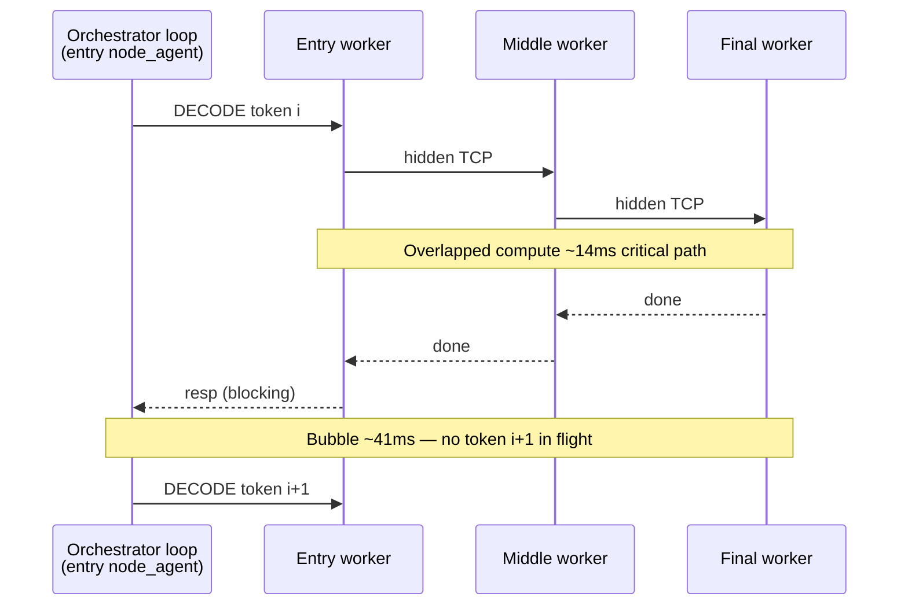

# Task 12.1 — Pipeline Stall Analysis (Docker, TinyLlama)

**Date:** 2026-07-07  
**Data:** `logs/perf_trace/docker_verify_20260707_151625/`  
**Trace:** `trace-000002` (benchmark `generate`, 8 tokens) + confirm `trace-000004` (steady decode)  
**Cluster:** 3× Docker CPU (`node-a/b/c`, no GPU)  
**Constraint:** read-only analysis, no runtime changes

---

## Executive summary

Pipeline queue depth is **always 1** because the system processes **exactly one decode token in flight** end-to-end:

1. **Orchestrator (entry node-agent) dispatches tokens strictly serially** — `pipeline_gen3_send_recv()` blocks until the full pipeline round-trip completes before sending the next token.
2. **Each worker runs a single-threaded blocking loop** — one `recv → compute → forward → respond` at a time.
3. **Hidden-state transport is synchronous TCP** — not a queue/buffer pipeline between nodes.

**Measured steady-state (Docker, tokens 2–7):**

| Metric | Value |
|--------|------:|
| Entry inter-arrival (round-trip proxy) | **54.4 ms** |
| Critical path (entry recv → final compute end) | **13.6 ms** |
| **Pipeline bubble (idle after token done)** | **40.8 ms (75%)** |
| Sum of stage compute (entry+middle+final) | 28.0 ms (overlapped → ~14 ms wall) |
| Network hop entry→middle | **0.04 ms** |
| Hidden transfer span | **< 0.1 ms** |

**Root cause ranking:**

| # | Cause | Verdict | Evidence |
|---|--------|---------|----------|
| 1 | **Synchronous orchestrator decode loop** | **PRIMARY bubble** | 41 ms idle / 54 ms period; code blocks per token |
| 2 | **Sequential request/response protocol** | **PRIMARY** | Single ctrl TCP connection; one token per RPC |
| 3 | **Single-threaded worker cmd loops** | **Explains queue depth = 1** | `recv` loop + depth counter never > 1 |
| 4 | Scheduler / `SCHED_QUEUE_WAIT` | **Intra-token only** | 84% inside GGML compute; not why depth=1 |
| 5 | Hidden-state transfer | **NOT a limit** | < 0.1 ms per hop |
| 6 | Orchestrator CPU sync (non-pipeline) | **Minor** | TTFT 89 ms PASS; not decode stall |

**Important:** HTTP benchmark reports **15.4 tok/s** (~65 ms/token). Perf trace `tokens.csv` **sum of stages (~7 s/token) is wrong for throughput** — it adds overlapped stage times. Use orchestrator `timing.decode_ms` or critical-path analysis below.

---

## Methodology

1. Load deduplicated decode events from `raw/*.jsonl` (one event per `node_id + ts + event`).
2. Identify the **fast 7-token session** on entry (`ENTRY_RECEIVE` cluster, 326 ms wall) — matches orchestrator `trace-000002` generate (`decode_ms=399 ms` for 8 tokens incl. token 0).
3. Align stages by **receive ordinal** (not `token_idx` — counters are local per worker and can diverge).
4. Per token:
   - **Critical path** = `FINAL_COMPUTE_END` − `ENTRY_RECEIVE`
   - **Period** = `ENTRY_RECEIVE[i]` − `ENTRY_RECEIVE[i−1]`
   - **Bubble** = period − critical path (cluster idle waiting for next orchestrator dispatch)

Reproduce:

```bash
PYTHONPATH=benchmarks python3 benchmarks/perf_trace/pipeline_stall_analysis.py \
  logs/perf_trace/docker_verify_20260707_151625/raw --trace trace-000002
```

---

## Per-token occupancy (steady-state)

Timeline relative to first entry receive in session. Compute bars use traced `*_COMPUTE_END` spans.

### Token ordinal 3 (representative)

```
Stage   |0        |10       |20       |30       |40       |50       |60ms
--------+------------------------------------------------------------------
entry   |█████                                             | 14.3ms compute
middle  |    ████                                            |  9.8ms
final   |        ███                                         |  5.7ms
bubble  |            ....................................  | 40.8ms idle
```

All three stages **overlap inside ~14 ms** for one token. The **bubble is after** final completes: workers sit idle until orchestrator injects the next token (~55 ms later).

### Full session table (`trace-000002`)

| Ord | tok | E recv | E cmp | M recv | M cmp | F recv | F cmp | period | cpath | **bubble** |
|----:|----:|-------:|------:|-------:|------:|-------:|------:|-------:|------:|-----------:|
| 0 | 1 | 0.0 | 13.8 | 4.6 | 9.1 | 8.7 | 5.0 | — | — | — |
| 1 | 2 | 54.2 | 13.6 | 58.7 | 9.1 | 62.7 | 5.0 | 54.2 | 13.5 | **40.7** |
| 2 | 3 | 108.3 | 13.5 | 112.8 | 8.9 | 116.8 | 4.9 | 54.1 | 13.4 | **40.7** |
| 3 | 4 | 162.2 | 14.3 | 166.7 | 9.8 | 170.6 | 5.7 | 53.9 | 14.1 | **39.8** |
| 4 | 5 | 217.2 | 13.7 | 221.9 | 9.0 | 225.9 | 4.9 | 55.0 | 13.5 | **41.5** |
| 5 | 6 | 272.3 | 13.5 | 276.7 | 9.1 | 280.7 | 5.0 | 55.0 | 13.4 | **41.6** |
| 6 | 7 | 326.5 | 13.6 | 330.9 | 9.1 | 335.0 | 5.0 | 54.2 | 13.5 | **40.7** |

**Avg:** period **54.4 ms**, critical path **13.6 ms**, bubble **40.8 ms**.

### Confirmation on long decode (`trace-000004`, 31 tokens)

| Metric | trace-000002 | trace-000004 |
|--------|-------------:|-------------:|
| Entry period | 54.4 ms | 56.5 ms |
| Critical path | 13.6 ms | 15.4 ms |
| Bubble | 40.8 ms | 41.2 ms |
| Entry compute | 13.7 ms | 15.5 ms |

Pattern is **stable** across warmup and steady decode.

---

## Why queue depth = 1

### Trace evidence

`queue.json` pattern for every token:

```
entry/middle/final: 1,1,1,1,1,1,...  (max depth = 1, avg = 1.0)
```

### Code evidence (depth counter design)

Workers increment depth **after** finishing a token and decrement **on receive** — with a single in-flight message, depth is always 0 or 1, reported as **1** at receive time:

```316:325:llama.cpp/tools/distributed/workers/split_gen3_a.cpp
        static int32_t entry_queue_depth = 0;
        if (decode_step && perf_trace_enabled()) {
            perf_trace_refresh_context();
            perf_trace_set_component("entry");
            perf_emit_instant("ENTRY_RECEIVE", perf_category::NETWORK, "entry", tok_idx, nullptr);
            perf_emit_queue_depth("entry", tok_idx, entry_queue_depth);
        }
        if (decode_step) {
            entry_queue_depth = std::max(0, entry_queue_depth - 1);
        }
```

```407:409:llama.cpp/tools/distributed/workers/split_gen3_a.cpp
        if (decode_step) {
            entry_queue_depth++;
        }
```

Same pattern in `split_gen3_b.cpp` and `split_gen3_c.cpp`.

**Interpretation:** depth=1 does **not** mean "pipeline filled to capacity" — it means **at most one buffered slot** exists because upstream sends **one token at a time**.

---

## Root-cause deep dive

### 1. Synchronous orchestrator decode loop — **PRIMARY bubble (75%)**

Entry node-agent drives decode:

```1218:1245:llama.cpp/tools/distributed/node_agent.cpp
    for (int step = 1; step < max_new; ++step) {
        ...
        } else if (!pipeline_gen3_send_recv(ctrl_fd, SPLIT_GEN_CMD_DECODE, 1, pos, layer_end, &cur, resp)) {
            err = "decode failed at step " + std::to_string(step);
            ...
        }
```

`pipeline_gen3_send_recv` is **blocking**:

```1057:1068:llama.cpp/tools/distributed/node_agent.cpp
static bool pipeline_gen3_send_recv(...) {
    if (!split_gen_send_req(ctrl_fd, cmd, n_tokens, pos_start, layer_end, 0, tokens)) {
        return false;
    }
    return split_gen3_recv_a_resp(ctrl_fd, resp, nullptr);
}
```

**Proof:** bubble **40.8 ms** ≈ period **54.4 ms** − critical path **13.6 ms**. Orchestrator cannot issue token *i+1* until token *i* fully returns through entry→middle→final→entry.

Orchestrator ground truth (`results.json`):

- `total_ms`: 514.9  
- `decode_ms`: 399.4 → **~50 ms/token** (matches 54 ms entry period)

### 2. Sequential request/response protocol — **PRIMARY (architectural)**

Entry worker accepts **one control request** per loop iteration:

```253:261:llama.cpp/tools/distributed/workers/split_gen3_a.cpp
        while (true) {
        ...
        perf_trace_sched_queue_wait_begin();
        const bool got_req = split_gen_recv_req(ctrl_fd, req, tokens_i32, &hidden_in, &hidden_n_embd);
        perf_trace_sched_queue_wait_end();
```

No pipelining of multiple decode commands on the ctrl socket. Middle/final similarly block on `split_ab_recv_hidden`.

### 3. Single-threaded workers — **explains depth=1**

Each worker process handles **one** hidden message / request at a time. No worker-side queue beyond the single slot tracked by `queue_depth`.

**Overlap exists only across stages (pipeline), not across tokens:** middle receives token *i* while entry may still finish token *i*, but entry receives token *i+1* only **~50 ms** later — after full RPC completion.

### 4. Scheduler / `SCHED_QUEUE_WAIT` — **NOT the queue-depth=1 cause**

GGML hook spans show **84%** `SCHED_QUEUE_WAIT` during graph execution (`ggml.json`). This is **inside** the 13–16 ms compute window, not the 41 ms inter-token bubble.

Worker I/O wait uses the same event name via `perf_trace_sched_queue_wait_begin/end` around `recv` — but measured network hops are **0.04 ms**, so I/O wait is not the stall.

### 5. Hidden-state transfer — **NOT a limit**

| Hop | Latency |
|-----|--------:|
| entry send → middle recv | 0.04 ms |
| HIDDEN_TRANSFER span | 0.05–0.07 ms |
| payload | 8192 bytes |

Network is **< 0.2%** of token period.

### 6. Orchestrator synchronous processing — **minor for decode**

TTFT **89 ms** (PASS). `CLIENT_RESPONSE` fires once after all tokens. Decode stall is **not** orchestrator JSON/HTTP — it's the **local pipeline RPC loop** on entry node-agent.

---

## Pipeline bubble diagram (steady token)



---

## What would change queue depth / throughput (analysis only)

Not implemented — for context:

| Change | Expected effect |
|--------|-----------------|
| Async multi-token dispatch from orchestrator | depth > 1, overlap tokens |
| Pipelined RPC (send i+1 before recv i) | shorter entry period |
| Batch decode commands | higher GPU/CPU util |
| Remove blocking `recv_a_resp` per token | reduce 41 ms bubble |

Current design **intentionally serial** — simple correctness, explains depth=1.

---

## Artifacts

| File | Description |
|------|-------------|
| `logs/perf_trace/docker_verify_20260707_151625/analysis/tokens.csv` | Per-stage sums (misleading for throughput) |
| `logs/perf_trace/docker_verify_20260707_151625/analysis/queue.json` | depth pattern 1,1,1 |
| `logs/perf_trace/docker_verify_20260707_151625/analysis/ggml.json` | SCHED_QUEUE_WAIT 84% inside compute |
| `logs/perf_trace/docker_verify_20260707_151625/benchmark/results.json` | Ground truth 15.4 tok/s |
| `benchmarks/perf_trace/pipeline_stall_analysis.py` | Repro script |

---

## Conclusion

**Queue depth = 1** is a **direct consequence of serial token dispatch**, not a hidden scheduler bug or network limit.

The **pipeline bubble (~41 ms, 75% of token period)** is time spent **waiting for the orchestrator's blocking round-trip** after each token completes — not idle due to hidden transfer or cross-node bandwidth.

Intra-token pipelining **works** (critical path ~14 ms across three stages). Inter-token pipelining **does not** — only one token is in flight at the system level.
