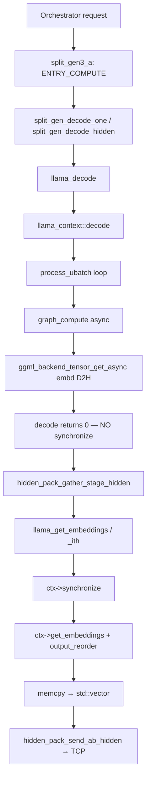
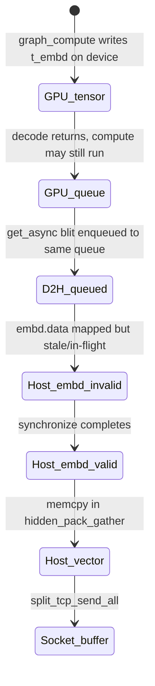

# Task 15.2 — GPU Synchronization Elimination Study

**Type:** Research / Architecture Investigation  
**Implementation:** ❌ None (read-only source + trace analysis)  
**Trace basis:** Task 15.1b homelab run `trace-000024` (entry node-a, Metal)  
**Scope:** Hidden-state output path only — from decode completion to transport handoff

---

## Executive summary

Task 15.1b established that ~83% of the ~5.7 ms “gather hidden” cost is `LLAMA_BACKEND_SYNCHRONIZE` (~4.7 ms), not transport or host memcpy. This document traces the **full lifecycle** of hidden state inside llama.cpp/GGML and answers whether `ggml_backend_sched_synchronize()` is fundamentally required or an artifact of the `llama_get_embeddings()` API contract.

**Root cause (one sentence):** The ~4.7 ms bottleneck is GPU-side completion wait — graph compute and the async D2H blit queued during `llama_decode()` finish inside `llama_get_embeddings()` via `ggml_backend_sched_synchronize()`, not in transport or host copy.

---

## 1. Runtime Call Graph

End-to-end path on **entry worker** (`split_gen3_a.cpp`) for a single-token decode wave.

### 1.1 High-level pipeline



### 1.2 Detailed call sequence (real functions)

| Phase | Function chain | Sync? | Notes |
|-------|----------------|-------|-------|
| **Decode entry** | `split_gen3_a` → `split_gen_decode_one()` → `llama_decode()` → `llama_context::decode()` | No | `split_gen_common.h:104–114` |
| **Batch / memory** | `balloc->init()` → `memory->init_batch()` → `process_ubatch()` | No | Partial-out path when `layer_end < n_layer` |
| **Graph build** (cache miss) | `model.build_graph()` → `ggml_backend_sched_alloc_graph()` | No | Reused on cache hit |
| **Graph execute** | `llama_context::graph_compute()` → `ggml_backend_sched_graph_compute_async()` → `ggml_backend_sched_compute_splits()` → per-split `ggml_backend_graph_compute_async()` → **Metal:** `ggml_metal_graph_compute()` | No | Returns after **submit**, not GPU done |
| **Hidden extract (decode)** | `res->get_embd()` → `ggml_backend_sched_get_tensor_backend(t_embd)` → `ggml_backend_tensor_get_async(backend_embd, t_embd, embd.data, …)` | No | Queues async D2H; ~0.42 ms CPU (trace) |
| **Decode return** | `llama_context::decode()` returns `0` | **Explicitly no** | Comment at `llama-context.cpp:2220–2222`: `//synchronize();` is disabled |
| **Gather (pack)** | `hidden_pack_gather_stage_hidden()` → `llama_get_embeddings()` or `llama_get_embeddings_ith()` | **Yes** | Per-token loop for `n_tokens > 1` |
| **Synchronize** | `llama_get_embeddings()` → `ctx->synchronize()` → `ggml_backend_sched_synchronize()` → `ggml_backend_synchronize()` per backend | **Yes** | ~4.72 ms (trace) |
| **Pointer access** | `ctx->get_embeddings()` → `output_reorder()` → return `embd.data` | After sync | ~0.14 ms (trace) |
| **Transport copy** | `std::memcpy(out, h, n_embd * sizeof(float))` | N/A | ~0.003 ms (trace) |
| **Wire send** | `hidden_pack_send_ab_hidden()` → `split_tcp_send_all()` | N/A | ~0.07 ms (trace) |

### 1.3 Task 15.1b trace correlation

| Span | Avg (ms) | When (relative) |
|------|---------:|-----------------|
| `GGML_GRAPH_EXECUTE` | 0.367 | Inside `ENTRY_COMPUTE` / decode — **CPU submit time** |
| `EMBD_D2H_GET_ASYNC` | 0.423 | End of decode — **D2H queue submit** |
| `LLAMA_BACKEND_SYNCHRONIZE` | 4.718 | Inside gather / `llama_get_embeddings` — **GPU completion wait** |
| `LLAMA_GET_EMBEDDINGS_ACCESS` | 0.144 | After sync — reorder + pointer |
| GATHER total | 5.674 | `hidden_pack_gather_stage_hidden` wall |

Decode returns before GPU work completes. The gap between `EMBD_D2H_GET_ASYNC` (during compute) and `LLAMA_BACKEND_SYNCHRONIZE` (during gather) may include orchestrator/CPU work; **cross-node wall timestamps are unreliable** (clock skew). Span **durations** are authoritative.

---

## 2. Backend Call Graph

Internal GGML path from scheduler synchronize to Metal/CUDA.

### 2.1 Scheduler layer

```
llama_context::synchronize()
  └─ ggml_backend_sched_synchronize(sched)          [ggml-backend.cpp:1904]
       └─ for each backend i in sched->n_backends:
            └─ ggml_backend_synchronize(backends[i])  [ggml-backend.cpp:414]
                 └─ backend->iface.synchronize(backend)  // NULL → no-op (CPU)
```

CPU backend (`ggml-cpu.cpp`) sets `synchronize = NULL` — no wait. GPU backends implement `synchronize`.

### 2.2 Metal backend (homelab entry node-a)

```
ggml_backend_synchronize(metal_backend)
  └─ ggml_backend_metal_synchronize()
       └─ ggml_metal_synchronize(ctx)               [ggml-metal-context.m:239]
            ├─ [ctx->cmd_buf_last waitUntilCompleted]   // last queued CB (compute tail or D2H blit)
            ├─ for cb_idx in 0..n_cb: check cmd_bufs[cb_idx] status
            └─ for cmd_buf in cmd_bufs_ext: wait + release   // extra async ops (incl. get_tensor_async)
```

**Graph submit path:**

```
ggml_backend_sched_graph_compute_async()
  └─ ggml_backend_sched_compute_splits()
       └─ ggml_backend_graph_compute_async(split_backend, &split->graph)
            └─ ggml_metal_graph_compute()           [ggml-metal-context.m:438]
                 ├─ encode + commit MTLCommandBuffers (parallel encode threads)
                 ├─ ctx->cmd_buf_last = last enqueued compute CB
                 └─ returns immediately (no waitUntilCompleted)
```

**Async D2H path (hidden extract during decode):**

```
ggml_backend_tensor_get_async(backend, t_embd, embd.data, …)   [ggml-backend.cpp:268]
  └─ backend->iface.get_tensor_async(...)
       └─ ggml_metal_get_tensor_async()            [ggml-metal-context.m:351]
            ├─ newBufferWithBytesNoCopy: embd.data (MTLResourceStorageModeShared)
            ├─ MTLBlitCommandEncoder copyFromBuffer: GPU tensor → shared host mapping
            ├─ [cmd_buf commit]  // no wait
            ├─ ctx->cmd_bufs_ext addObject: cmd_buf
            └─ ctx->cmd_buf_last = cmd_buf          // D2H CB becomes “last”
```

Metal comment at line 384–385: *“do not wait here for completion … wait for it later if needed”* — completion is deferred to `ggml_metal_synchronize()`.

### 2.3 CUDA backend (reference — not homelab entry)

```
ggml_backend_cuda_synchronize()                     [ggml-cuda.cu:3246]
  └─ cudaStreamSynchronize(cuda_ctx->stream())

ggml_backend_cuda_get_tensor_async()                [ggml-cuda.cu:3160]
  └─ cudaMemcpyAsync(..., cudaMemcpyDeviceToHost, stream)
```

Same pattern: async queue during decode, stream sync at `ggml_backend_sched_synchronize()`.

---

## 3. Hidden Lifecycle Diagram

Physical location of hidden state at each stage (entry partial-forward: `is_layer_partial_out() == true`).



| Stage | Location | Buffer / object | Valid for CPU read? |
|-------|----------|-----------------|---------------------|
| After graph node `norm` / model `t_embd` assignment | **GPU device memory** | `ggml_tensor * t_embd` in graph result | No |
| After `ggml_metal_graph_compute()` returns | GPU (in-flight) | Same tensor; CBs committed | No |
| After `ggml_backend_tensor_get_async()` returns | GPU → host **in flight** | Blit target: `embd.data` in `buf_output` (host / shared) | **No** — transfer incomplete |
| After `llama_decode()` returns | Host buffer allocated, **data not guaranteed** | `embd.data` slice of `buf_output` | No |
| After `ggml_backend_sched_synchronize()` | **Host RAM** (shared Metal buffer or CPU alloc) | `embd.data` | **Yes** |
| After `output_reorder()` | Host RAM (rows permuted if needed) | `embd.data` | Yes |
| After `llama_get_embeddings()` returns | Host pointer into `embd.data` | Same | Yes |
| After gather `memcpy` | `std::vector<float> hidden_buf` | Separate heap allocation | Yes |
| After TCP send | Kernel socket buffer | Copy of wire payload | Yes (receiver side) |

### Host output buffer allocation

`llama_context::output_reserve()` (`llama-context.cpp:2230+`):

- Allocates `buf_output` via `ggml_backend_buft_alloc_buffer()` — prefers **device host buffer type** (`ggml_backend_dev_host_buffer_type(output_dev)`) when available for faster D2H.
- Slices: `logits`, `embd`, `embd_nextn`, … as `buffer_view<float>` offsets into one contiguous block.
- For partial layer output: `has_embd = true` even when `cparams.embeddings == false`; `embd.size = n_embd_out * n_batch`.

---

## 4. Synchronization Analysis

### Q2. Why is `ggml_backend_sched_synchronize()` called?

**Caller:** `llama_context::synchronize()` → invoked from every **result-access** public API, including `llama_get_embeddings()`, `llama_get_logits()`, `llama_get_embeddings_nextn()`, etc. (`llama-context.cpp:748–755`, `3866–3878`).

**Why:**

| Reason | Applies? | Evidence |
|--------|----------|----------|
| Mandatory GPU fence before host reads async outputs | **Yes** | D2H queued with `get_tensor_async`; Metal explicitly defers wait |
| API contract: “results valid after get_*” | **Yes** | `llama.h:1005–1007`: synchronize auto-done when obtaining results |
| Wait for graph compute completion | **Yes** | Decode uses `graph_compute_async`; no wait at decode end |
| Wait for async D2H copy | **Yes** | D2H blit on same Metal queue after compute |
| Protective / defensive | Partially | Prevents reading `embd.data` while GPU still writing |
| Scheduler internal copy events | Only if multi-backend splits pending | Entry Metal homelab: primarily GPU backend sync |

**Not** called during decode: explicit comment disables end-of-decode sync (`llama-context.cpp:2220–2222`).

### Q3. What happens inside synchronize?

See §2. Metal: `waitUntilCompleted` on `cmd_buf_last` + status scan of parallel compute CBs + drain `cmd_bufs_ext`. CUDA: `cudaStreamSynchronize`.

### Q4. What exactly is waited on?

**Both**, on the same GPU queue timeline:

1. **Compute graph completion** — all matmul/attention kernels for the partial forward through `layer_end`.
2. **D2H blit completion** — `ggml_metal_get_tensor_async` copy from GPU tensor buffer into host-visible `embd.data`.

Metal queue ordering guarantees blit starts after compute producing `t_embd` finishes. A single `waitUntilCompleted` on the last command buffer (the D2H blit CB, which becomes `cmd_buf_last`) waits for the entire prior queue including compute.

**Not waited separately in application code:** no completion callback, no `ggml_backend_event` on the embd output path.

**Host-side memcpy** (`std::memcpy` in gather) happens **after** sync; it is not part of synchronize.

### Q6. When does hidden become valid?

| Moment | Valid? |
|--------|--------|
| Before `ggml_backend_sched_synchronize()` | **No** — GPU compute and/or D2H may be in flight |
| After synchronize, before `output_reorder()` | **Yes** (unless row reorder needed for multi-output batches) |
| After D2H blit completes (inside synchronize) | **Yes** |
| After `output_reorder()` | **Yes** — canonical row order for batch indices |
| After `llama_get_embeddings()` returns | **Yes** — pointer into valid host buffer |

For steady-state single-token decode on entry, `output_swaps` is typically empty; reorder cost is negligible (~0.14 ms trace includes pointer resolution + occasional swaps).

### Q10. What constitutes the ~4.7 ms synchronize?

From trace + source, **decomposition is inferential** (no GPU hardware counters in Task 15.1b spans):

| Component | In ~4.7 ms? | Confidence |
|-----------|-------------|------------|
| GPU compute (partial layers 0..layer_end) | **Likely majority** | Decode returns after ~0.37 ms CPU submit; sync waits for actual GPU time |
| D2H blit (2048-d float hidden ≈ 8 KB/token) | **Small fraction** | Payload tiny; blit latency ≪ compute for LLM forward |
| Metal `waitUntilCompleted` / driver fence | **Included** | Unavoidable part of sync call |
| Host memcpy | **No** | Measured separately: 0.003 ms |
| Scheduler loop overhead | **Negligible** | Simple for-loop over backends |

**Why exact split is unknown:** `LLAMA_BACKEND_SYNCHRONIZE` is one span covering compute + blit + fence. Separating compute vs D2H would require Metal GPU counters, split events, or a sync call immediately after decode (without D2H) for comparison — out of scope for this task.

**What we can state firmly:** the ~4.7 ms is **device-side completion wait**, not transport, not host serialization, not `output_reorder`.

---

## 5. API Analysis

### Q7. What does `llama_get_embeddings()` do?

```
llama_get_embeddings(ctx)                           [llama-context.cpp:3866]
  ├─ llama_perf_hook: LLAMA_GET_EMBEDDINGS begin
  ├─ ctx->synchronize()
  │    ├─ ggml_backend_sched_synchronize(sched)
  │    └─ perf accounting (n_queued_tokens, t_eval_us, …)
  ├─ llama_perf_hook: LLAMA_GET_EMBEDDINGS_ACCESS begin
  ├─ ctx->get_embeddings()
  │    ├─ output_reorder()    // lazy row swaps in embd.data
  │    └─ return embd.data
  └─ llama_perf_hook: end
```

`llama_get_embeddings_ith()` — identical except `get_embeddings_ith(i)` resolves row via `output_resolve_row(i)`.

**Internal bypass:** `llama_context::get_embeddings()` does **not** synchronize — only public wrappers do.

### Q8. Existing alternative APIs (no new proposals)

| API / mechanism | Purpose | Avoids sync in get_embeddings? | Useful for entry hidden output? |
|-----------------|---------|-------------------------------|--------------------------------|
| `llama_synchronize(ctx)` | Explicit wait (`llama.h:1008`) | Same wait, caller-chosen timing | **Relocate** sync, not eliminate |
| `ctx->get_embeddings()` (internal) | Pointer after caller sync | Yes, if caller synced first | Possible split: sync once, read many |
| `llama_get_hidden_state()` | Copy **input** hidden (`hidden_state_inp`) | N/A — not output path | **No** — middle-stage input injection only |
| `llama_set_hidden_state()` | Set input hidden for `layer_start > 0` | N/A | Input only |
| `ggml_backend_tensor_get()` (sync) | Blocking D2H | No — blocks calling thread | Would still wait, worse overlap |
| `ggml_backend_tensor_get_async()` | Non-blocking D2H queue | Defers wait to synchronize | Already used during decode |
| `ggml_backend_event_new/record/wait/synchronize` | Cross-stream / split sync | Theoretically finer-grained wait | Used in **scheduler split copies**, not exposed for embd output |
| `ggml_backend_sched_set_eval_callback` | Per-node eval hook | **Forces sync per sub-graph** when callback needs data | Opposite of elimination |
| Direct `t_embd` / tensor pointer access | — | **Not public** | No stable API |
| `ggml_backend_sched_graph_compute()` (sync variant) | Sync graph + sync sched | Sync at compute, not get | Would block decode return |
| Host-visible `buf_output` / `embd.data` | Pre-allocated host mapping | Data invalid until sync | Cannot skip wait, only skip API wrapper |

**Conclusion:** llama.cpp already exposes **`llama_synchronize()`** as the explicit wait primitive. There is **no** public API to obtain post-decode hidden embeddings without a full backend synchronize somewhere before host read.

---

## 6. Root Cause

**The ~5 ms hidden gather bottleneck arises because `llama_decode()` intentionally returns before GPU work finishes, and `llama_get_embeddings()` performs the mandatory `ggml_backend_sched_synchronize()` that waits for partial-forward compute plus async D2H into `embd.data` — this is required for correctness, but its placement inside the gather/transport path is an API design choice, not a transport limitation.**

---

## 7. Research Questions — Direct Answers

### Q1. Full hidden lifecycle (decode → transport)

Documented in §1 and §3. Key functions: `llama_decode` → `process_ubatch` → `graph_compute` → `ggml_backend_sched_graph_compute_async` → `ggml_backend_tensor_get_async` → *(async gap)* → `llama_get_embeddings` → `synchronize` → `get_embeddings` → `hidden_pack_gather_stage_hidden` → TCP send.

### Q2. Why synchronize?

Public result APIs enforce “data ready before pointer return.” Decode defers sync for overlap; gather pays the cost when reading `embd.data`.

### Q3. Inside synchronize?

Scheduler loops backends → Metal `waitUntilCompleted` + ext CB drain, or CUDA `cudaStreamSynchronize`.

### Q4. What is waited on?

GPU compute completion **and** D2H blit completion (same queue), not host memcpy.

### Q5. Output buffer lifecycle?

GPU tensor `t_embd` → async blit to host `embd.data` in `buf_output` → valid after sync → optional reorder → gather vector → socket.

### Q6. Validity timing?

Valid **after synchronize** (equivalently: after D2H blit completes, which is inside synchronize).

### Q7. `llama_get_embeddings` operations?

`synchronize` → `output_reorder` → return `embd.data` pointer (+ perf hooks).

### Q8. Alternative APIs?

See §5 table. **`llama_synchronize` + internal get** is the only relocation pattern using existing APIs. No sync-free hidden output API exists.

### Q9. Can synchronize be moved?

| Placement | Feasible? | Effect |
|-----------|-----------|--------|
| **Earlier** — `llama_synchronize()` right after decode, before gather | **Yes** (existing API) | Same total GPU wait; may **overlap** with orchestrator / other CPU work between decode return and gather today |
| **Later** — after gather alloc, before memcpy | Same as today for single-token | No gain |
| **Inside overlap** — sync while other nodes work | **Yes** architecturally | Requires pipeline scheduling change (Task 15.3+), not API change |
| **Removed from `llama_get_embeddings` only** | **Yes** if caller guarantees prior sync | Split API usage; must not read `embd.data` early |
| **Eliminated entirely** | **No** without skipping host read or reading GPU tensor directly | Would race GPU |

Fundamentally: sync must occur **before any host read of `embd.data`**. It is **not** fundamentally bound to `llama_get_embeddings()` — that function is where llama.cpp **currently** places it.

**Amplification:** `hidden_pack_gather_stage_hidden` calls `llama_get_embeddings_ith()` per token when `n_tokens > 1`, invoking synchronize **each iteration**. After the first call, subsequent syncs should be cheap (no pending GPU work) unless a new decode intervenes.

### Q10. Bottleneck composition

~4.7 ms = **GPU queue drain** (compute + ordered D2H + Metal fence). Host copy and wire send are **< 0.1 ms** combined (trace). Exact compute vs D2H fraction **not measurable** from current spans alone (see §4 Q10 table).

---

## 8. Optimization Opportunities (analysis only — no implementation)

### Option A — Relocate sync: `llama_synchronize()` immediately after decode

| | |
|--|--|
| **Idea** | Call explicit sync at end of `ENTRY_COMPUTE` before gather; use internal read or keep `llama_get_embeddings` knowing GPU already idle |
| **Pros** | Overlap GPU wait with orchestrator/network gap if gap exists today; clearer separation compute vs pack |
| **Cons** | Zero saving if gather follows immediately; must preserve ordering vs next decode |
| **Risk** | Double-sync if both decode path and get_embeddings sync; perf accounting side effects in `synchronize()` |

### Option B — Sync once per decode, not per `llama_get_embeddings_ith` call

| | |
|--|--|
| **Idea** | For prefill (`n_tokens > 1`), one `llama_synchronize()` then multiple `get_embeddings_ith` without re-entering public get API |
| **Pros** | Removes redundant fence checks on multi-token gather |
| **Cons** | Requires bypassing public API or new internal helper; prefill not steady-state decode bottleneck |
| **Risk** | API misuse if decode not complete |

### Option C — Pipeline overlap (sync during remote stage work)

| | |
|--|--|
| **Idea** | Return from entry decode early; run sync concurrently while B/C compute previous wave |
| **Pros** | Hides part of ~4.7 ms in parallel work |
| **Cons** | Needs buffer lifetime / ordering guarantees across waves |
| **Risk** | Correctness if hidden buffer reused before sync completes |

### Option D — Send from `embd.data` directly (skip gather memcpy)

| | |
|--|--|
| **Idea** | After sync, `split_tcp_send_all(fd, embd.data, …)` without `std::vector` copy |
| **Pros** | Removes one heap copy (trace: **0.003 ms** — negligible) |
| **Cons** | Does not address sync; buffer lifetime tied to ctx |
| **Risk** | Next decode may overwrite `embd.data` if not serialized |

### Option E — FP16 / zero-copy transport

| | |
|--|--|
| **Idea** | Reduce wire bytes |
| **Pros** | Helps network-bound deployments |
| **Cons** | Task 15.1b: gather dominated by sync, not copy/send |
| **Risk** | Precision / protocol change for ~0 ms local gain |

### Option F — Finer-grained `ggml_backend_event` on D2H only

| | |
|--|--|
| **Idea** | Wait on event recorded after blit instead of full backend sync |
| **Pros** | Could avoid waiting unrelated backend work |
| **Cons** | **Not exposed** for embd path today; still waits GPU |
| **Risk** | Requires GGML/llama.cpp changes (out of scope) |

### Option G — Keep GPU hidden on device (peer GPU copy)

| | |
|--|--|
| **Idea** | Skip D2H at entry |
| **Cons** | No existing distributed transport path; major architecture change |
| **Risk** | High |

**Ranking by expected impact on ~5 ms gather:** C > A ≈ B >> D > E > F > G.

---

## 9. Acceptance Criteria Checklist

| Question | Answer |
|----------|--------|
| Why is `ggml_backend_sched_synchronize()` called? | `llama_get_embeddings()` enforces “results ready” before returning host pointer; completes async graph + D2H queued during decode |
| What does it wait for? | GPU compute + async D2H into `embd.data` (Metal: `waitUntilCompleted`; CUDA: stream sync) |
| Where is hidden physically before/after sync? | Before: GPU `t_embd` + in-flight blit to host `embd.data`; After: valid host `embd.data` in `buf_output` |
| When is hidden valid? | After synchronize completes (inside `llama_get_embeddings`) |
| Fundamental necessity vs API artifact? | **Wait is fundamental** before host read; **placement in `llama_get_embeddings`** is API contract (`llama.h` documents auto-sync on result access). Decode deliberately omits sync for overlap |
| Existing mechanisms for future path changes? | `llama_synchronize()`, internal `get_embeddings()`, `ggml_backend_event_*` (scheduler), `get_tensor_async` + relocated sync, pipeline overlap |

---

## 10. References

| Artifact | Path |
|----------|------|
| Entry gather | `llama.cpp/tools/distributed/runtime_debug/hidden_transport_breakdown.cpp` |
| Decode / sync / get embeddings | `llama.cpp/src/llama-context.cpp` |
| Scheduler sync | `llama.cpp/ggml/src/ggml-backend.cpp` |
| Metal sync / async D2H | `llama.cpp/ggml/src/ggml-metal/ggml-metal-context.m` |
| CUDA sync / async D2H | `llama.cpp/ggml/src/ggml-cuda/ggml-cuda.cu` |
| Public API docs | `llama.cpp/include/llama.h` (`llama_synchronize`, `llama_get_embeddings`) |
| Task 15.1b trace | `docs/TASK_15_1b_HIDDEN_GATHER_ROOT_CAUSE.md`, `logs/perf_trace/task15_1b_verify_20260711_165558/` |

---

## 11. Non-Goals (confirmed)

No runtime, transport, pipeline, GGML, or llama.cpp changes were made. No new APIs proposed for implementation. This document is input for Task 15.3+ optimization design based on facts, not assumptions.
