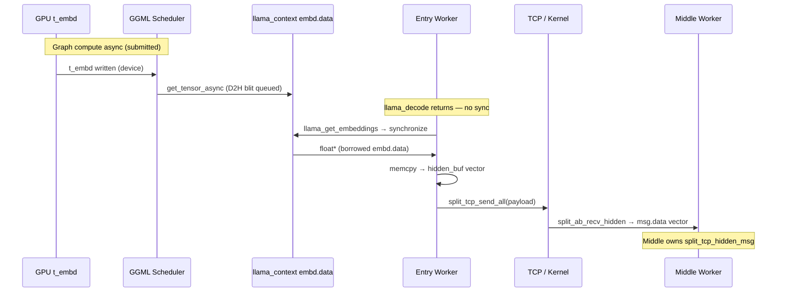
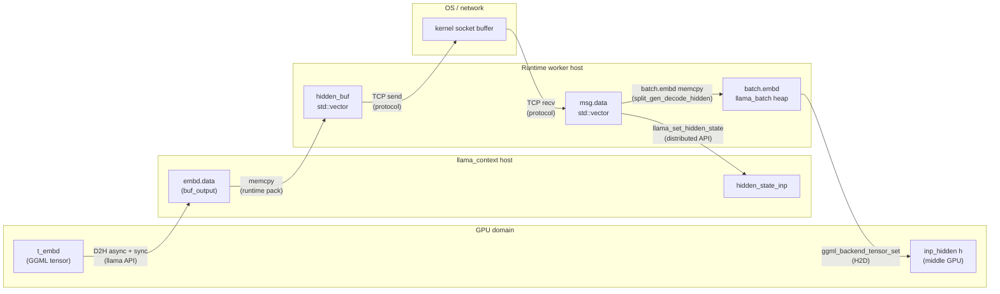
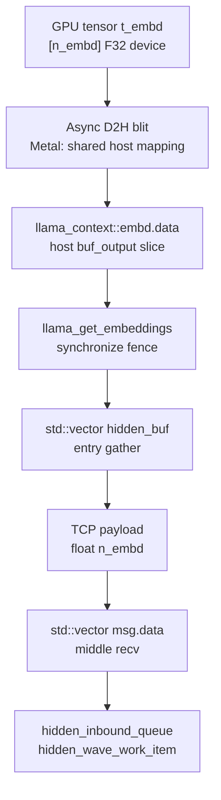

# Task 15.3 — Hidden Ownership & Dataflow Architecture Study

**Type:** Architecture Research  
**Implementation:** ❌ None  
**Depends on:** Task 15.1, 15.1b, 15.2  
**Scope:** From **GGML graph finished** (output tensor materialized on device) through **middle worker received hidden**  
**Homelab reference:** 3-node split (entry A → middle B → final C), TinyLlama, Metal entry

---

## Executive summary

The distributed runtime does **not** fundamentally require CPU ownership of hidden state — but the **current stack does**, because of layered design choices:

1. **llama.cpp** exposes results as **host `float*` pointers** after optional synchronize (`llama_get_embeddings`).
2. **llama-distributed.h** copies inbound hidden into **`hidden_state_inp`** (`llama_set_hidden_state`).
3. **Transport protocol** (`split_tcp_wire.h`) defines hidden as a **host `float[]` payload** over TCP.
4. **Workers** are **separate OS processes** on separate machines with no shared GPU address space.

CPU ownership is therefore **mandatory for the current implementation**, but **not the only possible architecture**. It is the intersection of llama.cpp’s CPU-oriented result API, the distributed extension’s copy semantics, and a localhost/TCP wire format — not a law of GGML itself.

---

## 1. Current Ownership Model

### 1.1 Ownership definition used in this document

| Term | Meaning |
|------|---------|
| **Owner** | Entity responsible for buffer lifetime and exclusive write authority |
| **Borrowed view** | Read pointer valid until owner reuses or frees the buffer |
| **Copy** | New allocation + duplicate bytes; ownership transfers to destination allocator |
| **Alias** | Same physical bytes, multiple logical views (e.g. pinned host mapped by GPU) |

### 1.2 Who owns hidden today (steady-state decode, entry → middle)

| Stage | Owner | Storage | Readers | Writers | Copy? |
|-------|-------|---------|---------|---------|-------|
| Graph output on GPU | **GGML / backend buffer pool** | `ggml_tensor * t_embd` device memory | GPU kernels | GPU (in-flight until sync) | No |
| After async D2H queued | **llama_context** (`buf_output`) | `embd.data` host slice | CPU after sync | GPU blit (in-flight) | **D2H transfer** (not a second allocation on entry) |
| After `llama_get_embeddings()` | **llama_context** (borrowed ptr) | same `embd.data` | Worker via returned `float*` | llama (next decode overwrites) | No |
| Gather buffer | **Entry worker** (`std::vector`) | `hidden_buf` | Entry worker | Entry worker | **memcpy** from `embd.data` |
| TCP send | **Kernel / OS** | socket send buffer | NIC stack | Entry worker (write via `send`) | **Copy into kernel buffer** |
| In-flight on network | **OS / NIC** | kernel buffers | — | — | — |
| Middle receive | **Middle worker** | `split_tcp_hidden_msg::data` (`std::vector`) | Middle worker | Middle worker | **recv copy into vector** |
| Before decode on B | **Middle worker** (+ llama copy) | `msg.data` + optionally `hidden_state_inp` | Middle worker | Middle worker | **`llama_set_hidden_state` memcpy** |
| Graph input on B GPU | **GGML / backend** | `inp->h` GPU tensor | GPU kernels | H2D via `ggml_backend_tensor_set` | **H2D transfer** |
| Middle output (to C) | Same pattern repeats | `embd.data` → vector → TCP → … | — | — | Same class of transitions |

**Runtime** (distributed worker process) becomes the long-lived owner at every **inter-process boundary** because neither llama.cpp nor GGML provides cross-process GPU handles or zero-copy IPC for hidden payloads.

---

## 2. Complete Hidden Lifecycle

Timeline from graph completion on entry through middle receive. “Graph finished” here means compute kernels for `t_embd` have been **submitted**; GPU completion is deferred until synchronize (Task 15.2).



### Phase-by-phase table (entry → middle receive)

| # | Event | Location | Owner after step |
|---|-------|----------|------------------|
| 1 | Last layer `il < layer_end` completes on GPU | `t_embd` in graph result | Backend GPU buffer |
| 2 | `ggml_backend_tensor_get_async(t_embd → embd.data)` | `llama-context.cpp` decode loop | llama_context host buffer (in-flight) |
| 3 | `llama_decode()` returns | Entry worker | llama_context; **data not yet valid on CPU** |
| 4 | `llama_get_embeddings()` → `synchronize()` | Gather | llama_context; **host valid** |
| 5 | Return `embd.data` pointer | Gather | llama_context owns; worker **borrows** |
| 6 | `memcpy` → `hidden_buf` | `hidden_transport_breakdown.cpp` | Entry worker vector |
| 7 | `hidden_pack_send_ab_hidden` | Transport | Entry reads vector; kernel owns send buf |
| 8 | `split_ab_recv_hidden` | Middle receiver thread | `msg.data` vector (middle worker) |
| 9 | `hidden_inbound_queue::push` | Middle | Queue holds `hidden_wave_work_item` (moved msg) |
| 10 | Processor `pop` → decode | Middle | Middle worker until `llama_set_hidden_state` / decode |

**Scope end:** Step 9–10 — middle worker has received hidden into `msg.data` and owns it in the inbound queue or processor thread. Steps 11+ (inject into llama, H2D, B→C send) are noted for continuity but are outside the strict scope end marker.

---

## 3. Ownership Transition Diagram



### Transition analysis (Phase B)

| Transition | Why ownership changes | Mandatory? | Classification |
|------------|----------------------|------------|----------------|
| GPU `t_embd` → host `embd.data` | llama.cpp output model: host-readable results via D2H into preallocated output buffer | **Yes** before any CPU read of embeddings | **API + correctness** (async pipeline) |
| `embd.data` → `hidden_buf` | Runtime gather decouples transport from llama buffer lifetime; next decode may overwrite `embd.data` | No — could send from `embd.data` directly after sync | **Runtime implementation** (Task 15.2 Option D) |
| `hidden_buf` → socket buffer | TCP `send()` requires contiguous userspace buffer; kernel copies to socket buffer | **Yes** for POSIX TCP | **OS / protocol** |
| Socket → `msg.data` | Separate process; no shared memory; `recv` into owned vector | **Yes** for current TCP inter-process design | **Runtime + protocol** |
| `msg.data` → `hidden_state_inp` | `llama-distributed.h`: *“Copied into context; caller may free data after the call.”* | No if using `batch.embd` only — but B calls both today | **Distributed API design** |
| `msg.data` / batch → GPU `inp->h` | Graph input lives on device; `llm_graph_input_hidden::set_input` uses `ggml_backend_tensor_set` | **Yes** before middle GPU forward | **GGML / backend model** |

---

## 4. Dataflow Diagram

Every byte movement from tensor to middle receive (single token, entry layers `[0, layer_end)`).



### Per-edge classification (Phase F)

| Edge | Mechanism | Bytes (TinyLlama) | Mandatory | Why |
|------|-----------|-------------------|-----------|-----|
| A→B | `ggml_backend_tensor_get_async` | ~8 KB/token | **Yes** for CPU read via current llama output path | llama copies graph output to host output buffer |
| B→C | Same blit targets `embd.data` | ~8 KB | **Yes** (alias into buf_output) | Not a separate heap allocation |
| C→D | `ggml_backend_sched_synchronize` | — | **Yes** before read | Task 15.2: ~4.7 ms wait, not a copy |
| C→E | `std::memcpy` | ~8 KB | **No** | Runtime chooses separate pack buffer |
| E→F | `split_tcp_send_all` | ~8 KB | **Yes** for TCP | Wire format requires host pointer |
| F→G | `split_tcp_recv_all` | ~8 KB | **Yes** for TCP cross-process | Separate address spaces |
| G→H | `std::move` into queue | 0 copy | **No** (move semantics) | Queue ownership transfer only |

**Copy count (entry → middle receive, current path):** 1 D2H + 1 gather memcpy + 1 TCP send copy + 1 TCP recv copy = **4 material byte movements** (plus synchronize fence). Of these, **D2H, TCP send, TCP recv** are structural; **gather memcpy** is optional at ~0.003 ms (Task 15.1).

---

## 5. Architectural Constraints (Phase G)

| Constraint | Fundamental? | Source | Notes |
|------------|-------------|--------|-------|
| Hidden only valid after graph compute completes | **Yes** | GPU execution model | Applies to any architecture |
| Host CPU read requires synchronize (current backends) | **Yes** for async D2H path | llama.cpp + GGML Metal/CUDA | Could use sync `tensor_get` instead — still waits |
| `llama_get_embeddings()` triggers synchronize | **No** — API choice | `llama.h` | `llama_synchronize()` can be called separately |
| Results exposed as host `float*` | **No** — API choice | `llama.h` | No public device tensor handle for `t_embd` |
| Output buffer reused each decode | **Yes** within one context | `llama_context::output_reserve` | Borrowed pointers invalid after next decode |
| Transport requires CPU buffer | **No** — protocol choice | `split_tcp_wire.h` | Comment: *“same as llama_get_embeddings()”* — encodes current API, not physics |
| Cross-node transfer requires serialization | **Yes** for separate machines | Network | Format could be GPU-RDMA, NCCL, etc. — not in repo |
| Middle inject requires H2D | **Yes** for GPU middle forward | `llm_graph_input_hidden::set_input` | Host hidden must reach `inp->h` on device |
| `llama_set_hidden_state` copies inbound data | **No** — API choice | `llama-distributed.h:19` | Explicit copy-into-context semantics |
| Scheduler assumes CPU ownership of outputs | **Effectively yes** for app layer | D2H in decode + get API | Scheduler owns GPU tensors; llama pulls to host |
| Separate processes cannot share GPU tensors | **Yes** (without special IPC) | OS / CUDA / Metal | No P2P in current runtime |

---

## 6. Phase C — llama.cpp Design Intent

### 6.1 Is CPU read the official architecture?

**Yes, for the public inference API.** llama.cpp is designed as a **host-consumer library**:

- `llama_decode()` runs the graph asynchronously.
- Result accessors (`llama_get_logits`, `llama_get_embeddings`, …) **synchronize then return host pointers** (`llama.h:1005–1031`).
- Output staging buffer `buf_output` is **CPU-accessible** (optionally device-pinned host buft for faster D2H).

This is **documented behavior**, not an accident: *“Wait until all computations are finished — automatically done when using … functions below to obtain the computation results”* (`llama.h:1005–1007`).

### 6.2 Backend-oriented APIs that exist

| Mechanism | Level | Used for hidden today? |
|-----------|-------|------------------------|
| `ggml_backend_tensor_get_async` / `_set` | GGML | **Yes** — D2H output, H2D input |
| `ggml_backend_sched_synchronize` | GGML | **Yes** — via `llama_get_embeddings` |
| `ggml_backend_event_*` | GGML | Scheduler split copies only; **not** embd output path |
| `ggml_backend_cpy_tensor_async` | GGML | Device-device between backends; **not** used for hidden transport |
| `ggml_backend_sched_set_eval_callback` | GGML | Per-node hook; **forces sync** when callback needs data |
| `llama_synchronize()` | llama.cpp | Explicit; same as internal sync |

### 6.3 Device-native output path?

**No public path.** `t_embd` is internal to `llm_graph_result`. Applications cannot obtain a stable GPU handle for hidden output without modifying llama.cpp/GGML.

Partial forward (`llama_set_layer_range`) is **official** for distributed inference (`llama-distributed.h`), but it still ends at **host** `llama_get_embeddings()` for export.

### 6.4 Does the scheduler assume downstream CPU use?

The scheduler tracks tensor placement and performs **async D2H into `embd.data` during decode** when `is_layer_partial_out()` — i.e. it **anticipates** host consumption without forcing sync at decode end. GPU tensor remains authoritative until synchronize; host buffer is the **staging target**, not an optional side path.

---

## 7. Alternative Ownership Models (Phase D)

Analysis only — no implementation proposed.

### Model A — Current: GPU → CPU → Transport → CPU → GPU

```
Entry GPU (t_embd) → D2H → embd.data → vector → TCP → msg.data → H2D → Middle GPU (inp->h)
```

| | |
|--|--|
| **Merits** | Simple; works across machines; matches llama public API; debuggable |
| **Limits** | D2H + H2D per hop; sync latency (~4.7 ms entry); 4 byte copies per hop |
| **llama.cpp** | **Fully compatible** — this is what APIs expect |
| **Current runtime** | **This is the implementation** |

### Model B — Pinned / shared host buffer end-to-end

```
GPU → blit into pinned buf_output → TCP send from same pages → recv into pinned recv buf → H2D
```

| | |
|--|--|
| **Merits** | Eliminates gather `std::vector`; possible zero-copy send with `sendmsg` from pinned memory |
| **Limits** | Still D2H + network + H2D; cross-node still copies over network; buffer lifetime tied to ctx |
| **llama.cpp** | **Partial** — `buf_output` already prefers device host buft; no API to export pinned handle |
| **Current runtime** | **Not used** — extra vector copy exists |

### Model C — Backend-native / GPU-resident between local stages

```
Entry GPU (t_embd) → backend copy → Middle GPU (inp->h)   [same machine, same GPU API]
```

| | |
|--|--|
| **Merits** | Avoids D2H/H2D on localhost multi-process if IPC existed |
| **Limits** | Requires shared CUDA/Metal context or IPC handles; **not available across homelab nodes** |
| **llama.cpp** | **Internal only** — `ggml_backend_cpy_tensor_async` exists; no llama wrapper |
| **Current runtime** | **Not implemented** — always TCP host payload |

### Model D — Peer-to-peer GPU (cross-node)

```
Entry GPU → NCCL / RDMA / GPUDirect → Middle GPU
```

| | |
|--|--|
| **Merits** | Theoretical best bandwidth/latency for multi-GPU clusters |
| **Limits** | Homogeneous hardware, drivers, security; no code in repo; llama has no transport layer |
| **llama.cpp** | **Not supported** |
| **Current runtime** | **Not supported** |

---

## 8. Compatibility Matrix

| Model | llama.cpp public API | GGML backends | Current runtime | Cross-node homelab | Complexity |
|-------|---------------------|---------------|-----------------|-------------------|------------|
| **A — Current CPU path** | ✅ Native | ✅ Metal/CUDA D2H/H2D | ✅ Implemented | ✅ TCP | Low |
| **B — Pinned host reuse** | ⚠️ Partial (`buf_output`) | ✅ Host buft exists | ❌ Not used for send | ✅ | Low–Med |
| **C — Backend-native local** | ❌ No public API | ⚠️ `cpy_tensor_async` | ❌ | ❌ Single host only | Med |
| **D — GPU P2P transport** | ❌ | ⚠️ Primitives only | ❌ | ❌ Not in protocol | High |
| **Shared memory IPC** | ❌ | N/A | ❌ | ❌ Separate hosts | Med |
| **Skip gather memcpy** | ✅ After sync | ✅ | ⚠️ Possible one-line | ✅ | Trivial |
| **Skip `llama_set_hidden_state` copy** | ⚠️ Use batch.embd only | ✅ | ⚠️ Partially (B still copies to batch) | ✅ | Low |
| **Completion events vs full sync** | ⚠️ GGML events exist | ⚠️ Not wired to embd | ❌ | ✅ | Med |
| **Persistent hidden ring buffer** | ⚠️ Must not overlap decode | ✅ | ❌ | ✅ | Med |

---

## 9. Phase E — Responsibility Analysis

### Who should own hidden?

| Layer | Ideal responsibility | Actual responsibility today | Why |
|-------|---------------------|----------------------------|-----|
| **llama.cpp** | Own graph I/O buffers; define sync + lifetime rules | Owns `buf_output`, `embd.data`, `hidden_state_inp`; defines sync at get | Library boundary: host-facing inference API |
| **GGML / backend** | Own device tensors; execute D2H/H2D | Owns `t_embd`, `inp->h`; performs transfers | Device memory manager |
| **Runtime (distributed workers)** | Orchestrate pipeline timing and buffer reuse | Owns `hidden_buf`, `msg.data`, queues; **chooses extra copies** | No GPU IPC; TCP protocol; process isolation |
| **Transport** | Move bytes between processes | TCP framing in `split_tcp_wire` | Stateless wire format |
| **Worker (A/B/C)** | Stage-local execution | Calls llama + transport in sequence | Process boundary |

**Why runtime becomes owner:** llama.cpp returns **borrowed** host pointers tied to `llama_context` lifetime; the next `llama_decode` may overwrite `embd.data`. The runtime cannot hold that pointer across async pipeline stages or network I/O without either (a) copying, or (b) delaying the next decode until send completes. The implementation chooses (a) plus TCP recv ownership on the middle side.

**Division of the ~5 ms cost (Task 15.2):** llama.cpp owns the **synchronize wait**; runtime owns **when** that wait happens (at gather via `llama_get_embeddings`). Transport owns **negligible** copy/send time.

---

## 10. Phase H — Existing Opportunities (mechanisms inventory)

| Mechanism | Exists in llama.cpp/GGML? | Used for hidden A→B today? | Notes |
|-----------|---------------------------|----------------------------|-------|
| Reuse host output buffer (`embd.data`) | ✅ | ❌ Gather uses separate vector | ~0.003 ms savings |
| Shared ownership / borrowed pointer | ✅ (documented implicit: invalid after next decode) | ❌ Runtime copies | Lifetime constraint |
| Persistent hidden buffer per wave | ❌ No first-class API | ❌ | Would need ring + sync discipline |
| Backend callbacks (`cb_eval`) | ✅ | ❌ | Syncs per sub-graph — worse for latency |
| Completion events (`ggml_backend_event_*`) | ✅ GGML | ❌ on embd path | Used for scheduler splits |
| Direct backend transport | ❌ | ❌ | No llama transport layer |
| GPU-native transport | ❌ | ❌ | — |
| `llama_synchronize` relocation | ✅ | ❌ | Overlap only; same total wait |
| `llama_set_hidden_state` skip (batch.embd direct) | ✅ | ⚠️ Partial | Still memcpy to batch + H2D |
| `ggml_backend_cpy_tensor_async` (D2D) | ✅ GGML | ❌ | Same-host only |
| Pinned host buffer (`dev_host_buft`) | ✅ | ⚠️ Implicit for `buf_output` | Not exposed to transport |
| Zero-copy TCP (`send` from `embd.data`) | OS API | ❌ | Possible after sync |
| `hidden_inbound_queue` move semantics | ✅ Runtime | ✅ | Avoids extra copy between recv and queue |

---

## 11. Conclusions

### Research question

> Must runtime receive hidden in CPU memory, or is current architecture only one implementation?

**Answer:** CPU memory is **not fundamentally required** for split inference in theory. It **is required** by the **current combination** of:

1. llama.cpp host-pointer result API with D2H staging,
2. llama-distributed copy-into-context semantics,
3. TCP `float[]` wire format,
4. separate processes without GPU IPC.

### Acceptance criteria

| Question | Answer |
|----------|--------|
| **Who owns hidden at each lifecycle stage?** | GPU backend → llama_context host (`embd.data`) → entry worker vector → kernel TCP → middle worker vector → (later) llama `hidden_state_inp` / GPU `inp->h` |
| **Why does ownership change?** | Process boundaries, API copy semantics, TCP transport, and GPU↔host address space mismatch |
| **Which transitions are mandatory vs API artifact?** | **Mandatory:** GPU compute complete before read; D2H before CPU read (current API); H2D before middle GPU forward; network copy across nodes. **Artifact:** gather vector memcpy, `llama_set_hidden_state` copy, sync placement inside `llama_get_embeddings` |
| **Which architectural models are possible within llama/GGML?** | A (current), B (pinned reuse), C (local D2D), event-based sync — see §7–8 |
| **Is current scheme the only possible one?** | **No.** It is the path of least resistance given existing APIs and TCP protocol |
| **Fundamental vs implementation constraints?** | **Fundamental:** GPU must finish before read; cross-machine transfer needs serialization; GPU input needs H2D. **Implementation:** host staging, extra copies, sync at get-embeddings, TCP float payload |

### Three closing statements

1. **CPU ownership is not physically mandatory** — but llama.cpp’s public contract is host-centric.
2. **Transport is not mandated to take a host pointer** — the protocol chose `float[]` aligned with `llama_get_embeddings()`.
3. **Current scheme is one implementation** — GGML retains GPU tensors internally; the runtime added CPU hops because no cross-process GPU ownership path exists.

---

## 12. References

| Artifact | Path |
|----------|------|
| Task 15.2 sync study | `docs/TASK_15_2_GPU_SYNCHRONIZATION_STUDY.md` |
| Task 15.1b gather root cause | `docs/TASK_15_1b_HIDDEN_GATHER_ROOT_CAUSE.md` |
| Distributed public API | `llama.cpp/include/llama-distributed.h` |
| Wire format | `llama.cpp/tools/distributed/transport/split_tcp_wire.h` |
| Entry gather / pack | `llama.cpp/tools/distributed/runtime_debug/hidden_transport_breakdown.cpp` |
| Middle recv / queue | `llama.cpp/tools/distributed/workers/split_gen3_b.cpp`, `wave_inbound_queue.h` |
| Hidden graph input | `llama.cpp/src/llama-graph.cpp` (`llm_graph_input_hidden`, `build_inp_hidden`) |
| Partial forward model | `llama.cpp/src/models/llama.cpp` |
| Output / sync / D2H | `llama.cpp/src/llama-context.cpp` |

---

## 13. Non-Goals (confirmed)

No code, runtime, transport, protocol, GGML, or llama.cpp changes. No new architecture designed for implementation. Research documents existing ownership and dataflow only.
