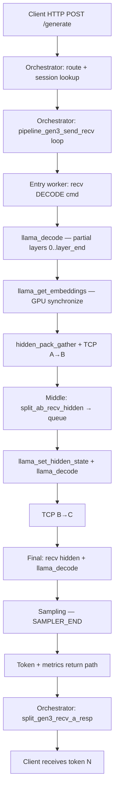
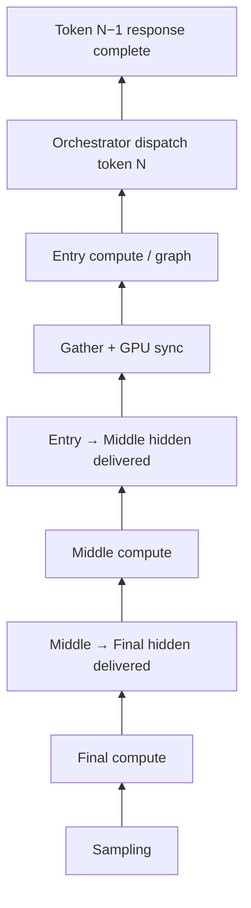

# Task 16.0 — End-to-End Token Lifetime Cost Attribution

**Type:** Architecture Research (trace-based cost model)  
**Implementation:** ❌ None  
**Primary trace:** Homelab `trace-000010` — `logs/perf_trace/task14_verify_clock_skew_20260711_162650/`  
**Supplement:** Task 15.1b gather (`trace-000024`), Docker stall study (`trace-000002`)  
**Model:** TinyLlama, 3-node split (entry M3 Pro → middle M1 Pro → final RTX 4070 Ti)

---

## Executive summary

**Ground-truth client throughput:** **25.77 tok/s** (orchestrator `decode_ms` / 32 tokens = **38.81 ms/token**).

**Serial critical path (dependency sum):** **27.08 ms/token** → theoretical ceiling **36.9 tok/s** if orchestrator bubble vanishes.

**Largest wall-clock gap:** **Orchestrator / scheduling bubble ~11.7 ms (30%)** — not the same magnitude as Docker CPU (~41 ms, 75%), but still the **single largest removable slice** on homelab.

**Largest on-path work (critical path %):**

| Rank | Stage | Avg (ms) | % of critical path |
|------|-------|---------:|-------------------:|
| 1 | Entry compute (partial forward + decode) | 8.79 | 32.5% |
| 2 | Final compute | 5.68 | 21.0% |
| 3 | Sampling (final) | 5.18 | 19.1% |
| 4 | Entry gather / A→B (`HIDDEN_TRANSFER`, mostly GPU sync) | 5.18 | 19.1% |
| 5 | Middle compute | 2.21 | 8.2% |
| — | B→C transport | 0.04 | 0.1% |

**Key insight:** Optimizing TCP, memcpy, or wire format cannot move TPS materially. **Orchestrator serial dispatch** and **entry GPU sync inside gather** are the trace-backed levers with double-digit TPS impact; **sampling** and **final compute** tie for second place on the critical path.

---

## 0. Metrics discipline (read this first)

Three numbers often confused:

| Metric | Formula | Homelab value | Use |
|--------|---------|--------------:|-----|
| **Client period** | `decode_ms / generated_tokens` | **38.81 ms** | What the user experiences (TPS) |
| **Serial critical path** | Σ dependent stage spans per wave | **27.08 ms** | Minimum time if pipeline stages overlap perfectly but work is serial |
| **Sum of stage spans (`tokens.csv` total_ms)** | Adds overlapped + mis-correlated wall times | **500–30,000+ ms** | ❌ **Invalid for throughput** |

Cross-node `ts_us` wall gaps are **clock-skewed** on homelab. This model uses **span durations** and **orchestrator timing** (Task 13.1 / 14 validation rules).

---

## 1. Complete Token Lifetime

### 1.1 Lifecycle diagram (client → client)



### 1.2 Steady-state decode token (WaveID ≥ 2, exclude prefill wave 0)

| # | Stage | Trace event(s) | Avg ms | Median | p95 |
|---|-------|------------------|-------:|-------:|----:|
| — | *(Orchestrator bubble — between tokens)* | gap not in spans | **11.73** | — | — |
| 1 | Orchestrator dispatch + entry recv | `ENTRY_RECEIVE` | *(in bubble)* | — | — |
| 2 | Entry compute | `ENTRY_COMPUTE_END` | **8.79** | 9.20 | 10.94 |
| 2a | ↳ GGML graph submit (subset) | `GGML_GRAPH_EXECUTE` | 0.37 | — | — |
| 2b | ↳ D2H queue (subset) | `EMBD_D2H_GET_ASYNC` | 0.42 | — | — |
| 3 | Entry gather + pack + A→B | `HIDDEN_TRANSFER` link=ab | **5.18** | 5.50 | 6.99 |
| 3a | ↳ GPU sync (subset, Task 15.1b) | `LLAMA_BACKEND_SYNCHRONIZE` | **4.72** | — | 6.97 |
| 3b | ↳ TCP send (subset) | `send_ms` in network.json | **~0.17** | — | — |
| 4 | Middle compute | `MIDDLE_COMPUTE_END` | **2.21** | 2.17 | 2.38 |
| 5 | B→C transport | `HIDDEN_TRANSFER` link=bc | **0.04** | 0.03 | 0.06 |
| 6 | Final compute | `FINAL_COMPUTE_END` | **5.68** | 5.81 | 7.36 |
| 7 | Sampling | `SAMPLER_END` | **5.18** | 5.34 | 6.77 |
| 8 | Return to orchestrator / client | `split_gen3_recv_a_resp` | *(in bubble)* | — | — |
| | **Serial critical path total** | formula §2 | **27.08** | 27.28 | 32.38 |
| | **Client period (TPS ground truth)** | orchestrator | **38.81** | — | — |

HTTP receive/response framing on the orchestrator is **not separately traced** in decode spans; it is negligible vs decode period on warm generate (TTFT trace **111 ms** once per session, not per token).

---

## 2. Cost Breakdown

### 2.1 As % of client period (38.81 ms) — what limits TPS today

| Stage | ms | % of period | Trace source |
|-------|---:|------------:|--------------|
| Serial critical path work | 27.08 | **69.8%** | `critical_path.json` |
| Orchestrator / scheduling bubble | 11.73 | **30.2%** | `period − serial_cp` |
| **Total** | 38.81 | 100% | `validation.json` TPS |

### 2.2 As % of serial critical path (27.08 ms) — where work happens

| Stage | Avg | Median | p95 | % cp |
|-------|----:|-------:|----:|-----:|
| Entry compute | 8.79 | 9.20 | 10.94 | 32.5% |
| Gather + A→B (`transfer_ab`) | 5.18 | 5.50 | 6.99 | 19.1% |
| Final compute | 5.68 | 5.81 | 7.36 | 21.0% |
| Sampling | 5.18 | 5.34 | 6.77 | 19.1% |
| Middle compute | 2.21 | 2.17 | 2.38 | 8.2% |
| B→C transport | 0.04 | 0.03 | 0.06 | 0.1% |

### 2.3 Entry gather decomposition (Task 15.1b, `trace-000024`)

| Sub-stage | Avg ms | % of gather |
|-----------|-------:|------------:|
| `LLAMA_BACKEND_SYNCHRONIZE` | 4.72 | 83% |
| Unattributed (inside GATHER span) | 0.81 | 14% |
| `EMBD_D2H_GET_ASYNC` (queued during decode) | 0.42 | 7% |
| `LLAMA_GET_EMBEDDINGS_ACCESS` | 0.14 | 3% |
| memcpy / TCP (Task 15.1) | ~0.07 | ~1% |

**Interpretation:** The 5 ms “transport” bucket in the critical path is **misnamed in pipeline accounting** — it is **`HIDDEN_TRANSFER` wall span** dominated by **gather = GPU sync**, not wire time.

---

## 3. Dependency Graph

Dependencies (must complete before downstream starts). **Not** the same as timeline order — stages on different nodes overlap in wall time.



### 3.1 Parallel vs serial

| Pair | Parallel? | Evidence |
|------|-----------|----------|
| Entry / middle / final compute **within one token** | **Yes** (pipeline overlap) | Docker + homelab: middle recv while entry still finishing; wall cp < sum compute |
| Token **N+1** dispatch vs token **N** pipeline | **No** | `pipeline_gen3_send_recv` blocks; queue depth = 1 |
| Gather vs next token entry compute | **No** (same worker) | Entry: decode → gather → send sequential |
| GPU sync vs middle recv | **Partial** | Sync on entry; middle can recv after send starts |
| Sampling vs middle forward | **No** | Sampling after final compute |

**Never parallel today:** inter-token orchestrator loop, entry gather vs next decode on same ctx without overlap redesign.

**Already parallel:** cross-stage compute for a single token (pipeline utilization **83.9%** middle-bound in `utilization.json` — middle is saturated; entry/final idle between tokens).

---

## 4. Critical Path

### 4.1 Definition used

**Serial critical path** (Task 14 / `metric_validation.py`):

```
entry_compute + transfer_ab + middle_compute + transfer_bc + final_compute + sampling
```

Homelab steady-state: **avg 27.08 ms**, **p95 32.38 ms**.

### 4.2 True wall-clock limiter

**Client period = serial critical path + orchestrator bubble.**

| Component | ms | If removed entirely |
|-----------|---:|---------------------|
| Serial critical path | 27.08 | Ceiling **36.9 tok/s** |
| Orchestrator bubble | 11.73 | Current **25.8 tok/s** → **36.9 tok/s** (**+43%**) |

On **Docker CPU** (reference): period **54.4 ms**, critical path **13.6 ms**, bubble **40.8 ms (75%)** — same architecture, **much larger** scheduling tax; eliminating bubble → **~37 tok/s (+140%)** from **15.4 tok/s** baseline.

### 4.3 What is *not* the critical path

| Component | Why |
|-----------|-----|
| B→C TCP | 0.04 ms |
| Kernel TCP send | ~0.17 ms |
| Host memcpy | ~0.003 ms (Task 15.1) |
| GGML `SCHED_QUEUE_WAIT` inside compute | Sub-ms to low-ms inside entry compute window; not inter-token bubble |
| Worker queue depth | Always 1 — symptom not cause |

---

## 5. Bottleneck Ranking

Ranked by **impact on client period** (trace-backed, homelab steady decode):

| Rank | Bottleneck | ms | % period | Removable? |
|------|------------|---:|---------:|------------|
| **1** | Orchestrator serial round-trip (bubble) | 11.73 | 30% | Architecture (Task 13.4/13.5) |
| **2** | Entry partial forward (compute) | 8.79 | 23% | Model/placement/shorter layers — not “free” |
| **3** | Final forward + head compute | 5.68 | 15% | Same |
| **4** | Sampling | 5.18 | 13% | Algorithm / placement |
| **5** | Entry GPU sync (in gather) | 4.72 | 12% | Sync relocation/overlap (Task 15.2/15.3) |
| **6** | Middle partial forward | 2.21 | 6% | Same as compute |
| **7** | Network / serialize | <0.2 | <1% | Already negligible |

**Important:** Ranks 2–4 are **real GPU/CPU work** — you cannot zero them without changing the model or splitting differently. Ranks 1 and 5 are **scheduling / API contract** costs.

---

## 6. What-If Analysis

Assumption: removing a **critical-path span** reduces client period by the same ms (bubble unchanged unless noted).  
Current: **25.77 tok/s** (38.81 ms).

| If instant… | Δ ms | New period | New TPS | Δ TPS |
|-------------|-----:|-----------:|--------:|------:|
| **Orchestrator bubble** | 11.73 | 27.08 ms | **36.9** | **+43%** |
| Entry compute | 8.79 | 30.02 ms | 33.3 | +29% |
| Gather total | 5.67 | 33.14 ms | 30.2 | +17% |
| Final compute | 5.68 | 33.13 ms | 30.2 | +17% |
| Sampling | 5.18 | 33.64 ms | 29.7 | +15% |
| **GPU sync only** | 4.72 | 34.09 ms | **29.3** | **+14%** |
| Middle compute | 2.21 | 36.60 ms | 27.3 | +6% |
| B→C transport | 0.04 | 38.78 ms | 25.8 | +0.1% |

### 6.1 New bottleneck after each removal

| Removed component | New bottleneck (next limit) |
|-------------------|----------------------------|
| Orchestrator bubble | Serial critical path (**entry compute** largest at 8.8 ms) |
| GPU sync / gather | Entry compute (8.8 ms) |
| Sampling | Final compute (5.7 ms) |
| Entry compute | max(final compute, sampling) ≈ 5.7 ms |
| Final compute | Entry compute + gather (14 ms) |
| Middle compute | Unchanged ordering; middle was never max |

**Ceiling chain:** After bubble removal → **36.9 tok/s**. After bubble + sync removal → critical path **22.4 ms** → **44.7 tok/s** theoretical if no new overlap limits.

---

## 7. Optimization ROI

ROI = expected TPS gain vs engineering effort and risk. **Not** ordered by raw ms alone.

| Optimization | Effort | Expected gain (homelab trace) | Risk | Priority |
|--------------|--------|------------------------------|------|----------|
| **Async / pipelined orchestrator dispatch** (Task 13.4/13.5) | High | **+43% TPS** (11.7 ms) | Correctness, ordering, KV | **P0** |
| **GPU sync overlap / relocation** (after 15.2/15.3) | Medium | **+14% TPS** (4.7 ms) | Buffer lifetime, race with decode | **P1** |
| **Sampling path reduction** (fused kernel, smaller vocab path) | Medium | **+15% TPS** (5.2 ms) | Quality / logits contract | **P1** |
| Final compute / placement tuning | Medium–High | +17% if halved (unlikely) | Cluster balance | P2 |
| Entry layer-range / smaller entry slice | High | Proportional to ms removed | Accuracy / protocol | P2 |
| Transport zero-copy / FP16 wire | Low | **<0.1% TPS** | Protocol break for ~0 ms | **P4 (defer)** |
| Skip gather memcpy | Trivial | **~0% TPS** | None | P4 |

### 7.1 Hypothesis check (from task brief)

| Hypothesis | Trace verdict |
|------------|---------------|
| 5 ms gather fix → +8% | **Close: +14%** for sync-only, **+17%** for full gather |
| Move sampling → +18% | **Plausible: +15%** if sampling instant (similar magnitude) |
| Async orchestrator → +40% | **+43%** on homelab; **+140%** on Docker CPU |

---

## 8. Recommended Order

Based on **ROI × trace impact**, not component isolation:

1. **Orchestrator / inter-token pipelining** — only change that moves TPS by ~40%+ without touching GGML.
2. **Entry GPU synchronize** — largest single span inside gather; overlaps with pipeline gap if dispatch async.
3. **Sampling + final compute** — tied on critical path; profile final node CUDA path separately.
4. **Middle compute** — small slice; middle already 100% utilized.
5. **Transport / serialization** — proven negligible; stop investing until sync and bubble addressed.

---

## 9. Dual-environment comparison

| Metric | Homelab GPU (`trace-000010`) | Docker CPU (`trace-000002`) |
|--------|------------------------------|-----------------------------|
| Client TPS | **25.8** | 15.4 |
| Client period | 38.8 ms | 54.4 ms |
| Serial critical path | **27.1 ms** | 13.6 ms |
| Bubble | **11.7 ms (30%)** | **40.8 ms (75%)** |
| Entry compute | 8.8 ms | 13.7 ms |
| Gather / A→B | 5.2 ms | ~0.04 ms hop* |
| Sampling | 5.2 ms | *(in final)* |
| Dominant limiter | Bubble + entry work | **Bubble only** |

\*Docker gather not separately inflated — CPU backend sync profile differs; homelab gather cost is Metal sync (Task 15.1b).

---

## 10. Research questions answered

| Question | Answer |
|----------|--------|
| Where does token time go? | 70% serial pipeline work, 30% orchestrator bubble (homelab) |
| If we remove component X, TPS delta? | See §6 what-if table (trace-derived) |
| Critical path vs expensive span? | Bubble limits wall clock; entry compute limits minimum physics |
| Is gather worth 5 ms optimization? | Only via **sync**, not transport — **+14%** max |
| Biggest engineering bet? | **Async orchestrator** (+43% homelab, +140% Docker) |

---

## 11. Reproduce

```bash
# Homelab analysis (already generated)
cat logs/perf_trace/task14_verify_clock_skew_20260711_162650/perf_trace/analysis/critical_path.json
cat logs/perf_trace/task14_verify_clock_skew_20260711_162650/perf_trace/analysis/validation.json

# Docker bubble reference
PYTHONPATH=benchmarks python3 benchmarks/perf_trace/pipeline_stall_analysis.py \
  logs/perf_trace/docker_verify_20260707_151625/raw --trace trace-000002

# Gather breakdown
cat logs/perf_trace/task15_1b_verify_20260711_165558/perf_trace/analysis/hidden_gather_breakdown.json
```

---

## 12. References

| Doc / artifact | Path |
|----------------|------|
| Task 12 pipeline stall | `docs/TASK_12_PIPELINE_STALL_ANALYSIS_DOCKER.md` |
| Task 15.1b gather | `docs/TASK_15_1b_HIDDEN_GATHER_ROOT_CAUSE.md` |
| Task 15.2 sync study | `docs/TASK_15_2_GPU_SYNCHRONIZATION_STUDY.md` |
| Task 15.3 ownership | `docs/TASK_15_3_HIDDEN_OWNERSHIP_STUDY.md` |
| Metrics spec | `docs/PERFORMANCE_METRICS_SPEC.md` |
| Critical path code | `benchmarks/perf_trace/metric_validation.py` |

---

## 13. Non-goals (confirmed)

No runtime, GGML, llama.cpp, transport, or scheduler code changes. This document is a **mathematical cost model** from existing traces to guide future work with measured priorities.
