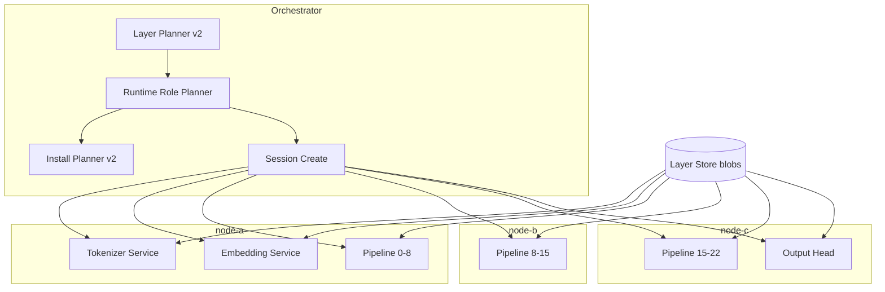

# Task 11 — Layer-First Runtime: Implementation Report

**Status:** Implemented (11.1–11.9)  
**Branch:** `feature/distributed-runtime`  
**Spec:** [TASK_11_LAYER_FIRST_RUNTIME.md](./TASK_11_LAYER_FIRST_RUNTIME.md)

---

## Goal

Replace the asymmetric entry-node pipeline with a **symmetric layer-first runtime**:

- Orchestrator assigns **runtime roles** (tokenizer, embedding, pipeline stages, output head, sampler)
- Workers load tensors from **Layer Store** via `TensorProvider` — no GGUF on the inference hot path
- **Materializer** demoted to compatibility-only (parity tests, export)
- **Install planner v2** places semantic blobs (embedding, output) on role-assigned nodes

---

## Target Data Flow

```
Client
  → Tokenizer Service (runtime_role::tokenizer)
  → token_ids
  → Embedding Service (runtime_role::embedding)
  → hidden states
  → Pipeline stages (runtime_role::pipeline_stage, layer ranges)
  → Output Service (runtime_role::output_head)
  → Sampler (runtime_role::sampler)
  → Client
```

**Env flags (Docker / production):**

| Variable | Default | Meaning |
|----------|---------|---------|
| `DIST_RUNTIME_LAYER_FIRST=1` | on in Docker | Skip GGUF materialization on inference path |
| `DIST_EXTERNAL_EMBEDDING=1` | on | Embedding is a separate service/role |
| `DIST_EXTERNAL_OUTPUT=1` | on | Output head is a separate service/role |
| `DIST_RUNTIME_FORCE_MATERIALIZE=1` | off | Force compat GGUF (debug only) |

---

## Subtasks (11.1 – 11.9)

### 11.1 — Runtime Roles

**Files:** `runtime/runtime_role.h`, `runtime/runtime_role_descriptor.h`, `runtime/runtime_graph.h`

Introduced `runtime_role` enum:

```
TOKENIZER | EMBEDDING | PIPELINE_STAGE | OUTPUT_HEAD | SAMPLER
```

`runtime_graph` holds `runtime_role_assignment` per node (host, ports, layer range, score).

**Tests:** `test-runtime-role-planner.cpp`

---

### 11.2 — Tokenizer Service

**Location:** `node_agent.cpp` — `/runtime/tokenizer/configure`, tokenizer loaded from Layer Store metadata (`metadata.bin`) when `worker_gguf` is empty and `bind_ready`.

Tokenizer removed from entry worker hot path; orchestrator configures tokenizer role before pipeline stages.

**Tests:** `test-embedding-service.cpp` (tokenizer + graph integration)

---

### 11.3 — Embedding Service

**Location:** `node_agent.cpp` — `/runtime/embedding/configure`, `/runtime/embedding/embed`

Loads via `runtime_load_model_from_layer_store()` with `worker_role::embedding`, layers `[0, entry_layer_end)`.

Entry pipeline stage receives `external_embedding=true` → starts at layer 1.

---

### 11.4 — Output Service

**Location:** `node_agent.cpp` — `/runtime/output/configure`

Final pipeline stage receives `external_output=true`; norm + lm_head on output role node.

---

### 11.5 — Planner v2 + Cost Model

**Files:** `runtime/runtime_role_planner.cpp`, `runtime/runtime_cost_model.cpp`

`dist_plan_runtime_graph()` assigns service roles using cost model (CPU score, memory, pipeline penalty). Pipeline layer ranges still come from memory-aware layer planner.

**Determinism fix:** candidates sorted by `node_id`; tie-break on equal cost.

**Tests:** `test-runtime-role-planner.cpp`, `test-runtime-cost.cpp`

---

### 11.6 — Session Create Refactor

**Location:** `orchestrator.cpp` — `setup_runtime_graph()`

Flow:

```
POST /session/create
  → layer layout (from registry or planner)
  → runtime graph (cached at layout time)
  → shutdown touched nodes
  → prepare service roles (tokenizer, embedding, output, sampler)
  → prepare pipeline stages (layer-first bind)
  → configure workers (skip_materialize=true)
  → session ready
```

**Cached runtime plan:** `dist_model_record.stored_runtime_graph` + `stored_runtime_install_nodes` set at `POST /models/{id}/layout` (`force:true`). Install map is always derived from stored graph so install and session agree.

---

### 11.7 — TensorProvider → llama Loader (critical path)

**Files:**

| File | Role |
|------|------|
| `runtime/layer_store_tensor_provider.*` | Maps tensor names → Layer Store blobs |
| `runtime/llama_layer_store_model_load.*` | `metadata.bin` → `gguf_init_from_buffer` → `llama_model_init_from_user(set_tensor_data)` |
| `workers/split_gen_model_load.*` | Worker children load via env + layer store |
| `runtime/runtime_worker_gguf_resolver.cpp` | Early return when `layer_first + tensors_ready`: empty `worker_gguf_path` |

**Worker env (set by node_agent):**

```
DIST_MODEL_ID, DIST_LAYER_STORE_ROOT, DIST_WORKER_ROLE
DIST_WORKER_LAYER_START, DIST_WORKER_LAYER_END
```

**Verified log line (no GGUF on hot path):**

```
node_agent: layer-store bind role=PIPELINE_STAGE layers=[1,8) (no gguf on inference path)
split_gen: loading model tinyllama-1.1b from layer store role=ENTRY layers=[1,8)
```

**Tests:** `test-runtime-layer-store-model-load.cpp`, `test-runtime-worker-bind.cpp`

---

### 11.8 — Materializer Demotion

**Files:** `runtime/runtime_compat_materialize.h`, renamed `configure_worker_runtime()` in `node_agent.cpp`

- Inference path: **never** calls `materialize_worker_gguf` when `DIST_RUNTIME_LAYER_FIRST=1`
- `runtime_compat_materialize_worker_gguf()` used only for verification/export
- Service configure endpoints accept empty `worker_gguf` + `model_id` when layer-first

**Metric:** `runtime_stats.materialization_count == 0` on all nodes during benchmark.

---

### 11.9 — Runtime-Graph Install Blob Sync

**Files:** `runtime/runtime_install_planning.*`, `architecture/install_planning.cpp`, `orchestrator/coverage/runtime_coverage.cpp`

`nodes_for_runtime_blob_deploy()` maps semantic blobs to runtime role nodes:

| Blob | Deploy target | Runtime node |
|------|---------------|--------------|
| metadata | entry_node | tokenizer_node |
| embedding | entry_node | embedding_node |
| output_norm / output_head | final_node | output_head_node |
| rope | all_nodes | all pipeline nodes |

`compute_runtime_coverage()` uses runtime install map (not legacy entry/final only) — fixes false `READY` when semantic blobs on wrong nodes.

**Tests:** `test-runtime-install-planning.cpp`

---

## Key Architecture Diagram



---

## CMake Targets

```
orchestrator, node_agent, split_gen3_{a,b,c}
test-runtime-role-planner, test-runtime-install-planning
test-runtime-layer-store-model-load, test-runtime-worker-bind
test-runtime-cost, test-embedding-service
```

---

## Known Issues / Follow-ups

1. **Docker OOM (exit 137):** node-a/node-c killed during multi-model benchmark when RAM exhausted (~7.65 GB/node). Mitigation: restart nodes between large models; `stop_if_not_fits: true` for Qwen 8B.
2. **Semantic blob sync:** benchmark sync loop must wait until `install-plan operation_count == 0` (not only layer coverage `READY`). Fixed in `benchmark_runner.py`.
3. **Runtime plan stability:** graph cached at layout time; install map derived from graph (not recomputed per request).

---

## Quick Verification

```bash
# Build
cd llama.cpp && cmake --build build --target orchestrator node_agent split_gen3_a -j8

# Docker cluster
cd tools/distributed/docker && docker compose up -d

# E2E
ORCHESTRATOR=http://127.0.0.1:9000 python3 run_e2e_generate.py --model tinyllama-1.1b

# Unit tests
./build/bin/test-runtime-install-planning
./build/bin/test-runtime-role-planner
```
